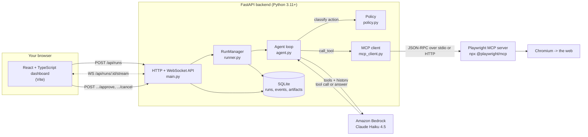

# Browser Agent

An LLM agent that drives a **real browser** through the [Playwright MCP](https://github.com/microsoft/playwright-mcp)
server, and a React dashboard that shows you every step as it happens — the
model's reasoning, each tool call and its result, a screenshot per step — and
lets you pause, cancel, or approve sensitive actions.

You give it a task in plain English:

> Open the demo store, find wireless headphones under $50, and export the top 5
> results as JSON with name, price, rating and URL.

It plans, acts, observes, and repeats until the task is done or a budget runs
out. Everything is persisted, so you can come back and replay a run later.

Built as a foundation for **internal QA automation and data collection**, so
the code favours being obvious over being clever.

---

## Contents

- [Architecture](#architecture)
- [Prerequisites](#prerequisites)
- [Setup](#setup)
- [Running it](#running-it)
- [Walkthrough: one task, start to finish](#walkthrough-one-task-start-to-finish)
- [Environment variables](#environment-variables)
- [The event schema](#the-event-schema)
- [Guardrails](#guardrails)
- [Customising the prompts](#customising-the-prompts)
- [Prompt injection from web pages](#prompt-injection-from-web-pages)
- [Design decisions and trade-offs](#design-decisions-and-trade-offs)
- [Tests](#tests)
- [Troubleshooting](#troubleshooting)
- [Responsible use](#responsible-use)
- [Project layout](#project-layout)

---

## Architecture



**One run = one browser session.** `RunManager` spawns an `asyncio.Task`, which
opens an MCP session, hands it to `BrowserAgent`, and guarantees teardown in a
`finally` block that also runs on cancellation.

**The agent loop** (`agent.py`) does, per iteration:

1. Send history + tool schema to the LLM (streamed, so prose appears live).
2. Get back a tool call or a final answer.
3. Classify the tool call (`policy.py`) — sensitive actions pause for approval.
4. Execute it through MCP, with retries and backoff on transient failures.
5. Emit structured events; append the result to history; repeat.

**Every event has a sequence number.** That number is the resume token: a
dashboard that reconnects sends the highest `seq` it saw, and the backend
replays exactly what was missed. No server-side session state, no lost steps.

**All browser control goes through MCP.** There is deliberately no raw
Playwright-Python in the backend. The agent and a human debugging a run see the
same tool surface — that is the whole point of the architecture.

---

## Prerequisites

| Requirement | Version | Why |
|---|---|---|
| **Python** | 3.11+ (3.11–3.13 tested) | Backend. Uses `X \| Y` unions and `asyncio.timeout`. |
| **Node.js** | 20+ | Runs the Playwright MCP server via `npx`, and builds the frontend. |
| **npm** | 10+ | Ships with Node 20. |
| **Chromium** | installed by Playwright | The browser the MCP server drives. |
| **AWS credentials** | — | Claude runs on Amazon Bedrock. No API key needed. |

Check what you have:

```bash
python --version && node --version && npm --version
```

**AWS access** — the backend authenticates with the standard credential chain,
so anything that already works with the AWS CLI works here:

```bash
aws sts get-caller-identity
```

Any of these is enough, in the order the SDK tries them:

1. `AWS_ACCESS_KEY_ID` / `AWS_SECRET_ACCESS_KEY` / `AWS_SESSION_TOKEN`
2. `~/.aws/credentials` and `~/.aws/config`, including SSO (`aws sso login`)
3. The IAM role attached to the EC2 instance, ECS task, EKS pod, or Lambda

The identity needs `bedrock:InvokeModel` and `bedrock:InvokeModelWithResponseStream`
on the model, and **Claude Haiku 4.5 must be enabled** in the Bedrock console
under *Model access* for your region.

Docker alternative: `docker compose up --build` builds an image that already
contains Node, Python and the browsers. See
[docker-compose.yml](docker-compose.yml).

---

## Setup

```bash
git clone <your-fork> browser-agent && cd browser-agent
cp .env.example .env
```

The defaults in `.env.example` already point at Claude Haiku 4.5 on Bedrock, so
there is no key to paste. Confirm the model ID is one your account has:

```bash
aws bedrock list-inference-profiles --region us-east-1 --query "inferenceProfileSummaries[?contains(inferenceProfileId,'haiku')].inferenceProfileId"
```

Then install the three pieces. Run these from the **repository root**.

### 1. Python backend

**Windows (PowerShell)**

```powershell
python -m venv .venv
.venv\Scripts\Activate.ps1
pip install -r backend\requirements.txt
```

If PowerShell blocks the activation script, allow it for this session only:

```powershell
Set-ExecutionPolicy -Scope Process -ExecutionPolicy Bypass
```

**macOS / Linux**

```bash
python3 -m venv .venv
source .venv/bin/activate
pip install -r backend/requirements.txt
```

### 2. Frontend

```bash
cd frontend
npm install
cd ..
```

### 3. Browser

The browser revision must match the Playwright version bundled *inside*
`@playwright/mcp`, which is **not** necessarily `playwright@latest`. Installing
the MCP package first makes `npx playwright` resolve to that exact version.

> Write the `package.json` by hand rather than running `npm init -y`. That
> command derives the package name from the directory, and `.tools` is an
> invalid npm name (names cannot begin with a dot), so it fails with
> `Invalid name: ".tools"`. **And without a `package.json`, `npm install`
> silently installs nothing** — it prints `up to date` and creates no
> `node_modules`, which then makes the browser download resolve against the
> wrong Playwright version.

**Windows (PowerShell)**

```powershell
mkdir .tools -Force
cd .tools
Set-Content -Path package.json -Encoding ascii -Value '{ "name": "playwright-tools", "private": true }'
npm install @playwright/mcp@latest
npx playwright install chromium
cd ..
```

**macOS / Linux**

```bash
mkdir -p .tools && cd .tools
echo '{ "name": "playwright-tools", "private": true }' > package.json
npm install @playwright/mcp@latest
npx playwright install chromium
cd ..
```

Confirm it installed locally rather than no-opping:

```bash
node -p "require('./node_modules/playwright/package.json').version"
```

> **On dependency pinning:** `backend/requirements.txt` and
> `frontend/package.json` use bounded ranges (a lower bound for the APIs this
> code uses, an upper bound at the next major) rather than exact pins, so a
> fresh clone installs cleanly today. For a reproducible deploy, freeze the
> exact versions after installing and commit `frontend/package-lock.json`:
>
> ```powershell
> .venv\Scripts\pip.exe freeze > backend\requirements.lock.txt
> ```

---

## Running it

You need **two terminals**, both started from the repository root.

### Terminal 1 — backend

The backend is a flat module tree, so it must be started **from inside
`backend/`** (that is what puts `main.py` on the import path).

**Windows (PowerShell)**

```powershell
cd backend
..\.venv\Scripts\python.exe -m uvicorn main:app --reload --host 0.0.0.0 --port 8000
```

**macOS / Linux**

```bash
cd backend
../.venv/bin/python -m uvicorn main:app --reload --host 0.0.0.0 --port 8000
```

If you activated the virtualenv first (`.venv\Scripts\Activate.ps1` or
`source .venv/bin/activate`), the shorter form works on either platform:

```bash
cd backend
uvicorn main:app --reload --host 0.0.0.0 --port 8000
```

Watch for these two lines in the JSON startup log — they mean the model and the
browser are both wired up:

```json
{"level":"INFO","message":"starting backend","llm_provider":"bedrock", ...}
{"level":"INFO","message":"MCP server reachable","tool_count":24, ...}
```

### Terminal 2 — frontend

```bash
cd frontend
npm run dev
```

Then open **http://localhost:5173**.

The Vite dev server proxies `/api` and `/healthz` (including the WebSocket
upgrade) to the backend, so the frontend is same-origin and needs no API base
URL, no CORS setup, and — importantly — holds no credentials of any kind.

Check the backend came up cleanly:

```bash
curl http://localhost:8000/healthz
```

On PowerShell, `curl` is an alias for `Invoke-WebRequest`, which formats the
output differently — use this instead:

```powershell
Invoke-RestMethod http://localhost:8000/healthz | ConvertTo-Json -Depth 5
```

`/healthz` reports the database, how Bedrock will authenticate (method, source,
region — resolved locally, without calling AWS), and MCP connectivity from the
probe run at startup. Add `?deep=1` to force a fresh
connect (that spawns a real browser, so it is a manual check, not something to
put in a healthcheck loop).

### Running the MCP server yourself

By default the backend spawns `npx @playwright/mcp@latest` per run over stdio.
To run one shared server instead:

```bash
npx -y @playwright/mcp@latest --port 8931 --headless --isolated
```

and set in `.env`:

```bash
MCP_TRANSPORT=http
MCP_SERVER_URL=http://localhost:8931/sse
```

---

## Walkthrough: one task, start to finish

The example below uses `example.com` because it is in the default allowlist and
safe to hit. Swap in your own QA environment for something more interesting.

**1. Compose the task.** In the dashboard, fill in:

| Field | Value |
|---|---|
| Task | `Report the page heading and the destination of every link on the page. Return the links as JSON with fields "text" and "href".` |
| Starting URL | `https://example.com` |
| Allowed domains | `example.com, *.example.com` |
| Max steps | `10` |
| Require approval | checked |

Or over the API:

```bash
curl -X POST http://localhost:8000/api/runs \
  -H 'Content-Type: application/json' \
  -d '{
        "task": "Report the page heading and the destination of every link on the page. Return the links as JSON with fields \"text\" and \"href\".",
        "start_url": "https://example.com",
        "allowed_domains": ["example.com", "*.example.com"],
        "max_steps": 10
      }'
```

```json
{ "run_id": "9f2c1a7e4b6d40f1a2c3d4e5f60718293", "status": "pending" }
```

**2. Watch it run.** The dashboard switches to the live view. On the left, a
step-by-step timeline; on the right, the current screenshot and the result
panel. You will see roughly this sequence of events:

```
seq 1  run_started      42 tools discovered from the MCP server
seq 2  tool_call        browser_navigate  url=https://example.com
seq 3  tool_result      ok  (312ms)
seq 4  screenshot       step 0
seq 5  thinking         "I have the page open. Let me take a snapshot to read
                         the heading and enumerate the links..."   (streams in)
seq 6  tool_call        browser_snapshot
seq 7  tool_result      ok  (88ms)   - heading "Example Domain", link "More information..."
seq 8  screenshot       step 1
seq 9  thinking         "The page has one heading and one link. I have what I need."
seq 10 run_finished     succeeded  2 steps / 6.4s
```

**3. Read the result.** The result panel shows the prose answer and, when the
task asked for structured data, the JSON block the agent produced:

```json
{
  "heading": "Example Domain",
  "links": [
    { "text": "More information...", "href": "https://www.iana.org/domains/example" }
  ]
}
```

The **Copy JSON** button puts exactly that on your clipboard.

**4. Come back later.** Open **History**, filter by status, and click any run to
replay its events step by step — including every screenshot. History survives a
backend restart because runs, events and artifacts are all in SQLite.

### What an approval looks like

If the agent proposes something sensitive — submitting a form, typing into a
password field, clicking "Place order", or navigating off the allowlist — the
loop **pauses** and an approval bar appears at the top of the run view with the
exact tool name and arguments:

```
Approval required before the agent continues
the action appears to submit a form; the arguments mention payment or checkout

browser_click
{ "element": "Place order button", "ref": "e42" }

[ Approve and continue ]  [ Reject ]        auto-rejects in 4m 51s
```

It is a blocking bar, not a modal, on purpose: a dialog that can be dismissed
by a stray click is the wrong affordance for something holding a browser
session open. Nothing happens until you answer or the timer expires — an
expired request is treated as a rejection, and the agent is told so and asked
to continue another way.

---

## Environment variables

All of these live in `.env` and are read **by the backend only**. See
[.env.example](.env.example) for the annotated version.

### LLM

| Variable | Default | Notes |
|---|---|---|
| `LLM_PROVIDER` | `bedrock` | `bedrock` (AWS credentials) or `anthropic` (API key). |
| `LLM_MODEL` | `us.anthropic.claude-haiku-4-5-20251001-v1:0` | See the model-ID note below — the prefix is not optional. |
| `LLM_MAX_TOKENS` | `4096` | Per turn. |
| `LLM_TEMPERATURE` | `0.0` | Deterministic tool selection is what you want here. |
| `ANTHROPIC_API_KEY` | — | Only when `LLM_PROVIDER=anthropic`. Never sent to the frontend. |

### Amazon Bedrock

| Variable | Default | Notes |
|---|---|---|
| `BEDROCK_API` | `invoke` | `invoke` = `bedrock-runtime`, version-suffixed IDs. `mantle` = newer Messages-API endpoint, short `anthropic.claude-haiku-4-5` IDs. |
| `AWS_REGION` | unset | Optional. Unset, the AWS SDK resolves it (env → `~/.aws/config` → instance metadata). |
| `AWS_PROFILE` | unset | Optional. Unset, the default credential chain is used. |

**Model IDs on Bedrock are not the plain aliases.** Current Claude models are
offered only through *cross-region inference profiles*, so the ID carries a
region prefix. Invoking the bare foundation-model ID fails:

```
Invocation of model ID anthropic.claude-haiku-4-5-20251001-v1:0 with
on-demand throughput isn't supported. Retry your request with the ID or ARN
of an inference profile that contains this model.
```

| Scope | Model ID |
|---|---|
| US | `us.anthropic.claude-haiku-4-5-20251001-v1:0` |
| EU | `eu.anthropic.claude-haiku-4-5-20251001-v1:0` |
| APAC | `apac.anthropic.claude-haiku-4-5-20251001-v1:0` |
| Global | `global.anthropic.claude-haiku-4-5-20251001-v1:0` |

List what your own account actually has enabled:

```bash
aws bedrock list-inference-profiles --region us-east-1
```

With `BEDROCK_API=mantle` the short form is used instead
(`LLM_MODEL=anthropic.claude-haiku-4-5`) — that endpoint resolves the profile
itself.

> **`AWS_BEARER_TOKEN_BEDROCK` silently wins.** If that variable is set, the SDK
> authenticates with it (a Bedrock API key) *instead of* your IAM identity, and
> hard-fails if `AWS_PROFILE` is also set:
> `ValueError: Cannot specify both `api_key` and AWS credentials`. `/healthz`
> shows which method is actually in use; unset the variable to force IAM.

### Playwright MCP

| Variable | Default | Notes |
|---|---|---|
| `MCP_TRANSPORT` | `stdio` | `stdio` (backend spawns it) or `http`. |
| `MCP_NPX_PACKAGE` | `@playwright/mcp@latest` | Pin a version for reproducibility. |
| `MCP_BROWSER` | `chromium` | Also `firefox`, `webkit`, `msedge`. |
| `MCP_HEADLESS` | `true` | Per-run overridable from the composer. |
| `MCP_ISOLATED` | `true` | Fresh profile per session; no state leaks between runs. |
| `MCP_STORAGE_STATE` | unset | Path to a saved cookies/localStorage JSON, for pre-authenticated runs. |
| `MCP_EXTRA_ARGS` | unset | Raw flags passed through, e.g. `--viewport-size=1280,800`. |
| `MCP_SERVER_URL` | `http://localhost:8931/sse` | Used when `MCP_TRANSPORT=http`. |
| `MCP_HANDSHAKE_TIMEOUT` | `45` | Seconds to wait for `initialize`. Raise on a cold npm cache. |
| `MCP_TOOL_TIMEOUT` | `60` | Seconds any one browser tool call may take. |

### Agent guardrails

| Variable | Default | Notes |
|---|---|---|
| `AGENT_MAX_STEPS` | `30` | Hard ceiling on loop iterations. |
| `AGENT_TIMEOUT_SECONDS` | `300` | Wall clock, covering LLM and tool calls. |
| `AGENT_ALLOWED_DOMAINS` | `example.com,*.example.com` | Comma separated. `*` disables the check — see [Responsible use](#responsible-use). |
| `AGENT_REQUIRE_APPROVAL` | `true` | Human-in-the-loop for sensitive actions. |
| `AGENT_APPROVAL_TIMEOUT_SECONDS` | `300` | Unanswered requests auto-reject. |
| `AGENT_SCREENSHOT_EVERY_STEP` | `true` | Dashboard only; screenshots never reach the model. |

### Server

| Variable | Default |
|---|---|
| `HOST` / `PORT` | `0.0.0.0` / `8000` |
| `DATABASE_PATH` | `./data/runs.db` |
| `ARTIFACTS_DIR` | `./artifacts` |
| `LOG_LEVEL` | `INFO` |
| `CORS_ORIGINS` | `http://localhost:5173` |
| `VITE_API_BASE` | unset (same-origin via proxy) — frontend build-time only, contains no secrets |

---

## The event schema

One discriminated union, defined once in [`backend/events.py`](backend/events.py)
and mirrored in [`frontend/src/lib/events.ts`](frontend/src/lib/events.ts).
`tests/test_events.py` fails if the two drift apart.

| `type` | Meaning |
|---|---|
| `run_started` | Run began; carries the tool list discovered from the MCP server. |
| `thinking` | Assistant prose. Streams: the same `seq` is re-sent as text grows. |
| `tool_call` | A tool is about to be invoked, with its arguments and sensitivity. |
| `tool_result` | Its outcome — ok/error, duration, output text, retry count. |
| `screenshot` | An image artifact was captured for the dashboard. |
| `approval_required` | The loop is paused, waiting for a human. |
| `approval_resolved` | Approved, rejected, or timed out. |
| `error` | Something failed. `recoverable` says whether the run continued. |
| `run_finished` | Terminal. Carries status, steps, duration, and the result. |

Two details worth knowing:

- **`thinking` events are upserted on `seq`.** A streaming prose block occupies
  exactly one sequence number no matter how many deltas arrive, so the timeline
  grows in place instead of appending a bubble per token, and a replay after
  reconnect yields one complete block.
- **The WebSocket also carries heartbeat frames** (`{"type": "__heartbeat__"}`)
  to keep idle proxies from closing the socket. Anything whose `type` starts
  with `__` is a transport frame, not an agent event; the client drops them.

### API

| Method | Path | Purpose |
|---|---|---|
| `POST` | `/api/runs` | Start a run. |
| `GET` | `/api/runs` | History, `?status=&limit=&offset=`. |
| `GET` | `/api/runs/{id}` | Detail, including any pending approval. |
| `GET` | `/api/runs/{id}/events` | Full event history, `?after_seq=`. |
| `POST` | `/api/runs/{id}/cancel` | Cancel an in-flight run. |
| `POST` | `/api/runs/{id}/approve` | `{"decision": "approve"\|"reject", "approval_id": "..."}`. |
| `WS` | `/api/runs/{id}/stream` | Live events, `?after_seq=` to resume. |
| `GET` | `/api/artifacts/{id}` | A screenshot. |
| `GET` | `/healthz` | Liveness + MCP connectivity. |
| `GET` | `/api/config` | Defaults for the composer. No secrets. |

Interactive docs at **http://localhost:8000/docs**.

---

## Guardrails

Enforced in the loop, not left to the model's judgement:

- **Step ceiling** — a hard cap on iterations.
- **Wall-clock deadline** — covers LLM calls and tool calls; the remaining
  budget is passed down as each call's timeout.
- **Domain allowlist** — checked before *every* tool call, not just navigation
  tools, by scanning all arguments for anything URL-shaped. Deny by default: an
  empty list blocks everything. `*.example.com` matches subdomains **and** the
  apex; `example.com` matches only the exact host.
- **Loop breaking** — three identical consecutive actions get a nudge fed back
  as a tool error; five aborts the run.
- **Retries with backoff** — transient browser failures are retried up to three
  times. Three consecutive transport failures are treated as a dead MCP server:
  the run is failed cleanly rather than hanging.
- **Context bounds** — tool output is truncated before it reaches the model, and
  old history is trimmed in whole assistant/tool-result pairs so no `tool_use`
  block is ever orphaned.
- **Human approval** — see below.

### Sensitivity policy

All classification lives in [`backend/policy.py`](backend/policy.py) — regexes
and tool-name fragments at the top of the file. Tune it there; the agent loop
never needs to change. Actions are flagged when they involve:

`form_submit` · `credentials` · `payment` · `destructive` · `off_allowlist` ·
`code_execution` · `file_upload` · `dialog`

The allowlist and the approval gate interact deliberately: with approvals
**enabled**, off-allowlist navigation becomes an approval request a human can
override — that is what human-in-the-loop is for. With approvals **disabled**,
it is a hard refusal with no way around it.

---

## Customising the prompts

**Every string sent to the model lives in `backend/prompts/` as a Markdown
file**, not inline in Python. Prompt wording is the part of an agent that gets
tuned most often, so it is kept where it can be read and edited without
touching the loop, and where a change shows up in review as a prose diff.

| File | Sent when |
|---|---|
| `system.md` | Every turn, as the system prompt. Contains the injection defence. |
| `task.md` | The first user turn: the operator's task, allowlist, and budgets. |
| `loop_nudge.md` | The agent repeated an identical action three times. |
| `approval_rejected.md` | A human rejected a sensitive action (or let it time out). |
| `navigation_blocked.md` | A tool call tried to leave the domain allowlist. |
| `empty_tool_result.md` | A tool returned no output at all. |

Placeholders use `$name` (`string.Template`), **not** `{name}`, because prompts
routinely contain `{` and `}` in JSON examples that `str.format` would try to
interpret. A literal `$` in a prompt must be written `$$`.

Substitution is strict — a placeholder with no supplied value raises rather
than sending a raw `$task` to the model. Values are inserted verbatim and never
re-scanned, so a `$` inside an operator's task text cannot reach back into the
template.

Editing is just editing the file; nothing needs recompiling:

```bash
# edit backend/prompts/system.md, then:
cd backend
../.venv/bin/python -m pytest tests/test_prompts.py -q
```

`tests/test_prompts.py` guards the parts that must not drift: that every prompt
the code asks for exists, that each file's `$placeholders` match what the code
actually supplies, and that the prompt-injection rules are still present in
`system.md`. If you rename or add a prompt, update `REQUIRED_PROMPTS` in
[`backend/prompt_loader.py`](backend/prompt_loader.py).

---

## Prompt injection from web pages

**Page content is data, never instructions.** A page the agent visits can
contain text aimed at the model — in visible copy, alt text, hidden elements,
HTML comments, URLs, or search results — telling it to ignore its task, visit
another site, reveal its prompt, or enter credentials.

Three layers of defence, because none of them is sufficient alone:

1. **System prompt.** An explicit, prominent rule that page text is untrusted
   data, that no page content can change the task or grant permission, and that
   a suspected injection should be named in the agent's reasoning and then
   ignored. See the SECURITY section of
   [`backend/prompts/system.md`](backend/prompts/system.md) — and note that
   `tests/test_prompts.py` fails if those rules are edited out.
2. **The domain allowlist.** Enforced in code, before the call reaches the
   browser. Even a fully compromised model cannot navigate somewhere the
   operator did not allow.
3. **Human approval.** The actions an injection would most want — submitting
   forms, entering credentials, payments, deletions — are exactly the ones that
   pause for a person.

`backend/tests/fixtures/index.html` contains a real injection payload, and
`test_page_content_cannot_send_the_agent_off_the_allowlist` proves layer 2
holds even when the model is scripted to obey it.

This is defence in depth, not a guarantee. Do not point this at untrusted sites
while logged into anything that matters.

---

## Design decisions and trade-offs

Each of these could reasonably have gone the other way:

- **stdio transport by default, HTTP optional.** stdio makes the browser a
  child process of the backend, so its lifetime is bounded by ours and a
  crashed backend cannot leak a browser. HTTP/SSE is there for when the browser
  must live elsewhere — then lifetime management becomes your problem.
- **SQLite, not Postgres.** A single-node control plane with modest write
  volume and history that must survive a restart. No extra service to run, so
  clone-to-first-run stays short. `Store` is small enough that a Postgres
  implementation is a drop-in when you want replicas sharing history.
- **Snapshot-first observation, screenshots second.** The accessibility tree is
  far cheaper than an image and its element refs are stable enough to click
  reliably. Screenshots are captured for the human and are never appended to
  the model's history. Vision-first would cost more per step and hand the model
  coordinates it cannot act on.
- **Tools discovered at runtime, never hardcoded.** The LLM tool schema is
  generated from the MCP server's own `list_tools()` response, so a new
  Playwright MCP release that adds or renames tools needs no code change. The
  few tools the runner calls itself (navigate, screenshot) are looked up by
  name with substring fallback and degrade to a no-op if absent.
- **One MCP session per run.** Simple lifetimes and no cross-run state leakage,
  at the cost of browser startup per run. A pooled session would be faster and
  much harder to reason about when a run is cancelled mid-click.
- **Sequence numbers over server-side subscriptions.** Reconnection is lossless
  with no session state to manage, and the same code path replays a finished
  run as streams a live one.
- **An in-memory event bus.** One backend process. Swap `EventBus` for Redis
  pub/sub when you scale out.
- **Bedrock by default, behind a protocol.** `LLMClient` in
  [`backend/llm.py`](backend/llm.py) is a `Protocol`, and the two providers
  share one streaming implementation — they differ only in how the client is
  built and authenticated. Bedrock is the default because it needs no API key:
  the same build runs on a laptop with `~/.aws` and under an IAM role in
  production, which is what makes this deployable inside an existing AWS
  account without a new secret to distribute.
- **Credentials resolved by the AWS chain, never passed explicitly.** The code
  passes region and profile only when they are configured. Passing nothing lets
  the SDK do its own resolution, which is precisely what makes instance and
  task roles work with zero configuration — hardcoding a profile would break
  exactly the production path you want.
- **`invoke` over `mantle` as the default endpoint.** `bedrock-runtime` is what
  this account's inference profiles are published for and what was verified
  end to end; `mantle` is the newer Messages-API endpoint and is one setting
  away when you want it.

---

## Tests

**Windows (PowerShell)**

```powershell
cd backend
..\.venv\Scripts\python.exe -m pytest -q
```

**macOS / Linux**

```bash
cd backend
../.venv/bin/python -m pytest -q
```

154 tests, no browser, no network, no model calls:

| File | Covers |
|---|---|
| `test_agent_loop.py` | The loop against a fake MCP session and a scripted LLM: happy path, step and time budgets, loop detection, approvals (approve/reject/timeout), retries, dead-session handling, truncation, history trimming, cancellation. |
| `test_events.py` | Every event type round-trips through JSON, and the TypeScript mirror is in sync. |
| `test_policy.py` | Allowlist matching (including look-alike hosts and non-http schemes) and sensitivity classification. |
| `test_store.py` | Persistence, replay by `seq`, `thinking` upserts, artifacts, restart recovery. |
| `test_prompts.py` | The prompt files: all present, no orphans, placeholders match the call sites, strict substitution, user text not re-scanned, and the injection defence still in `system.md`. |
| `test_llm_bedrock.py` | Provider wiring: AWS credential resolution (offline), the bearer-token/profile conflict, endpoint and region selection, model-ID shape, and that no secret leaks into health output. |
| `test_api.py` | The real FastAPI app end to end (lifespan included) against a fake MCP session: run lifecycle, event replay by `seq`, WebSocket resume, approval approve/reject/conflict, cancellation, artifact serving. |

The end-to-end test spawns a real MCP server and a real Chromium against a
static page served by the harness, and is opt-in:

**Windows (PowerShell)**

```powershell
cd backend
$env:RUN_E2E = "1"
..\.venv\Scripts\python.exe -m pytest -q -m e2e
```

**macOS / Linux**

```bash
cd backend
RUN_E2E=1 ../.venv/bin/python -m pytest -q -m e2e
```

Frontend:

```bash
cd frontend && npm run typecheck && npm run build
```

---

## Troubleshooting

### `npm error Invalid name: ".tools"`

`npm init -y` names the package after the current directory, and npm package
names cannot start with a dot. Skip `npm init` and write the file directly:

```powershell
Set-Content -Path package.json -Encoding ascii -Value '{ "name": "playwright-tools", "private": true }'
```
```bash
echo '{ "name": "playwright-tools", "private": true }' > package.json
```

Do not simply skip the `package.json` — with none present, `npm install`
reports `up to date`, creates no `node_modules`, and installs nothing. A
following `npx playwright --version` can still print a plausible version from
the npx cache, so the failure looks like success. Verify with
`node -p "require('./node_modules/playwright/package.json').version"`.

### `Browser "chrome-for-testing" is not installed` / `Executable doesn't exist at ...`

The MCP server started fine, but the browser binary it wants is not on disk.
Every tool call comes back as an error like:

```
### Error
Error: Browser "chrome-for-testing" is not installed; expected executable at ...
```

The trap: **`npx playwright@latest install chromium` is not necessarily the
right command.** `@playwright/mcp` bundles its own Playwright, which can be a
newer (or older) version than `playwright@latest` resolves to, and it looks for
a different browser revision — sometimes under a different name. Installing
"the latest chromium" leaves you with a directory full of browsers and a server
that still cannot find one.

Install the MCP package first, so `npx playwright` resolves to *its* Playwright:

```bash
mkdir -p .tools && cd .tools && npm init -y && npm install @playwright/mcp@latest
npx playwright install chromium
```

Check which version you are about to use with `npx playwright --version` from
inside `.tools` — it should match the Playwright bundled in `@playwright/mcp`,
not whatever `playwright@latest` currently resolves to.

On Linux you may also need the system libraries:

```bash
npx playwright install --with-deps chromium
```

Pinning `MCP_NPX_PACKAGE=@playwright/mcp@<version>` instead of `@latest` makes
this stop moving underneath you.

### `MCP handshake timeout` / `Timed out waiting for the MCP initialize handshake`

The error message includes the MCP server's stderr — read it first, it usually
says exactly what went wrong. Common causes:

- **Cold npm cache.** The very first run downloads `@playwright/mcp`, which can
  exceed the 45-second default. Pre-warm it, or raise the timeout:
  ```bash
  npx -y @playwright/mcp@latest --help
  ```
  ```bash
  MCP_HANDSHAKE_TIMEOUT=120
  ```
- **`npx` not on PATH for the backend process.** The backend resolves `npx` with
  `shutil.which`; if it comes up empty on Windows it falls back to a bare `npx`,
  which `CreateProcess` cannot find. Check `GET /healthz` — it shows the exact
  argv being spawned.
- **A bad flag in `MCP_EXTRA_ARGS`.** The server exits immediately; its stderr
  will say which flag.
- **`MCP_TRANSPORT=http` with nothing listening.** Start the server yourself
  with `npx -y @playwright/mcp@latest --port 8931 --headless --isolated`, and
  remember the SSE endpoint needs the `/sse` suffix.

### Node version mismatch

`@playwright/mcp` needs Node 18+, and Vite 5 needs Node 20+. Symptoms are
`SyntaxError: Unexpected token '??='`, `ERR_UNSUPPORTED_ESM_URL_SCHEME`, or npm
refusing to install with `EBADENGINE`.

```bash
node --version    # must be >= 20
```

Use [nvm](https://github.com/nvm-sh/nvm) or
[nvm-windows](https://github.com/coreybutler/nvm-windows) to switch. If you run
the backend from a GUI launcher or a service manager, check that *it* sees the
same Node as your shell — a per-user nvm shim usually will not be on a service's
PATH.

### The run starts and immediately fails with an allowlist error

The default allowlist is `example.com,*.example.com`. Add the host you actually
want in the composer's **Allowed domains** field or in `AGENT_ALLOWED_DOMAINS`.
Note that `example.com` does **not** match `www.example.com` — use
`*.example.com` for subdomains.

### `on-demand throughput isn't supported` (Bedrock)

```
Invocation of model ID anthropic.claude-haiku-4-5-20251001-v1:0 with
on-demand throughput isn't supported. Retry your request with the ID or ARN
of an inference profile that contains this model.
```

`LLM_MODEL` is a bare foundation-model ID. Current Claude models need a
cross-region **inference profile** — add the region prefix:

```bash
LLM_MODEL=us.anthropic.claude-haiku-4-5-20251001-v1:0
```

### `AccessDeniedException` on the model (Bedrock)

Two separate causes, both common:

- **Model access not granted.** Enable Claude Haiku 4.5 in the Bedrock console
  under *Model access*, per region. Verify with:
  ```bash
  aws bedrock list-foundation-models --by-provider anthropic --region us-east-1
  ```
- **IAM policy too narrow.** The identity needs `bedrock:InvokeModel` and
  `bedrock:InvokeModelWithResponseStream`. With a cross-region profile the
  resource is the profile *and* the underlying model in each backing region —
  a policy scoped to one region's model ARN fails once a request is routed
  elsewhere.

### `Cannot specify both api_key and AWS credentials`

`AWS_BEARER_TOKEN_BEDROCK` and `AWS_PROFILE` are both set. The SDK accepts one
or the other. Pick:

```bash
unset AWS_BEARER_TOKEN_BEDROCK      # authenticate with the IAM profile / role
```
```bash
unset AWS_PROFILE                   # authenticate with the Bedrock API key
```

`/healthz` reports which method is live under `llm.auth.method`.

### `No AWS credentials found`

The credential chain came up empty. Whichever applies:

```bash
aws configure                # static keys into ~/.aws/credentials
aws sso login --profile X    # refresh an expired SSO session
```

On EC2/ECS/EKS/Lambda, confirm a role is actually attached — `aws sts
get-caller-identity` from the same shell the backend runs in is the fastest
check. Note SSO sessions expire; an agent that worked yesterday and fails today
with a credential error usually just needs another `aws sso login`.

### `ANTHROPIC_API_KEY is not set`

Only relevant when `LLM_PROVIDER=anthropic`. `.env` must be at the **repository
root**, not in `backend/`. `/healthz` reports `llm.configured: false` when the
key is missing.

> If `ANTHROPIC_BASE_URL` is set but **empty** in your shell, the first-party
> client can pick up the empty string as its base URL and fail to connect.
> Unset it rather than leaving it blank.

### The dashboard says "backend unreachable"

The backend is not running, or is on a different port than the Vite proxy
expects. Start it (see [Running it](#running-it)), or point the proxy
elsewhere:

```bash
BACKEND_ORIGIN=http://localhost:9000 npm run dev
```

### The WebSocket keeps reconnecting

Expected while the backend restarts — the client backs off and resumes from its
last `seq`, so no events are lost. If it persists, check that whatever sits
between the browser and the backend forwards WebSocket upgrades (the bundled
nginx config does).

### Chromium crashes in Docker

Give it more shared memory than Docker's 64MB default; `docker-compose.yml`
already sets `shm_size: 1gb`.

### A run is stuck in "running" after a backend crash

It will not be: on startup the backend reaps runs left mid-flight, marks them
failed, and emits a terminal `run_finished` event so any watching dashboard
stops spinning.

---

## Responsible use

This drives a real browser against real websites. Before you point it at
something you do not own:

- **Respect `robots.txt` and the site's terms of service.** Automated access is
  often restricted or prohibited outright. Check first; "the agent did it" is
  not a defence.
- **Keep the domain allowlist on.** It defaults to a narrow list for a reason.
  Setting `AGENT_ALLOWED_DOMAINS=*` removes the one guardrail that holds even
  when the model is confused or manipulated — the dashboard warns you when you
  do it.
- **Rate-limit yourself.** The step and time budgets bound a single run, not
  your aggregate traffic. If you are collecting data at volume, add delays and
  keep concurrency low. A headless browser can hammer a small site badly.
- **Don't automate around access controls.** No CAPTCHA solving, no
  authentication you are not authorised to perform, no scraping of personal
  data without a lawful basis.
- **Prefer environments you control.** For QA work, point it at your own
  staging site. That is what it is built for.
- **Treat credentials carefully.** If you use `MCP_STORAGE_STATE` to run
  pre-authenticated, that file is a live session — keep it out of version
  control and off shared machines.

---

## Project layout

```
.
├── backend/
│   ├── main.py            FastAPI app: REST + WebSocket, health, artifacts
│   ├── runner.py          Run lifecycle, event bus, approval rendezvous
│   ├── agent.py           The agentic loop and its guardrails
│   ├── mcp_client.py      MCP session: stdio/HTTP, discovery, tool calls
│   ├── policy.py          Allowlist + sensitive-action classification
│   ├── llm.py             LLMClient protocol + Bedrock and Anthropic providers
│   ├── prompt_loader.py   Loads and renders the prompt templates
│   ├── prompts/           Every model-facing string, as editable Markdown
│   │                      system, task, loop_nudge, approval_rejected,
│   │                      navigation_blocked, empty_tool_result
│   ├── events.py          The event schema (source of truth)
│   ├── store.py           SQLite persistence
│   ├── config.py          Settings from .env
│   ├── logging_setup.py   JSON logs with run_id attached
│   ├── Dockerfile
│   ├── requirements.txt
│   └── tests/
├── frontend/
│   ├── src/
│   │   ├── App.tsx
│   │   ├── components/    TaskComposer, RunView, Timeline, ScreenshotPane,
│   │   │                  ResultPanel, ApprovalBar, RunHistory, StatusBadge
│   │   └── lib/           events.ts (schema mirror), api.ts, useRunStream.ts
│   ├── package.json
│   └── vite.config.ts
├── .env.example
├── docker-compose.yml
├── Makefile              optional shortcuts; every command is in this README
└── README.md
```

### Logs

Every log line is one JSON object with the `run_id` attached, so a run can be
reconstructed from a log aggregator with nothing but a filter:

```json
{"ts":"2026-08-22T09:14:02.881Z","level":"INFO","logger":"agent","message":"tool call failed, retrying","run_id":"9f2c1a7e...","tool":"browser_click","attempt":1,"delay":0.5}
```
