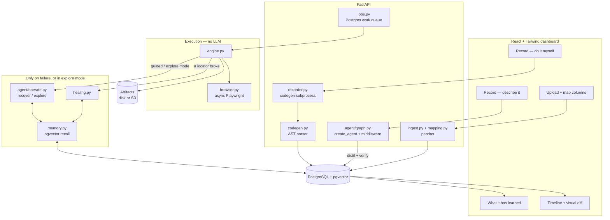

# TRACE

**T**ask **R**ecording & **C**onsistent **E**xecution.

Record a browser workflow by doing it **once**, map a spreadsheet onto it, and
replay it over a thousand rows — **without an LLM in the loop**.

New install? Start with [`INSTALL.md`](INSTALL.md) — an ordered, copy-paste
walkthrough from a fresh clone to a signed-in dashboard. This document covers
the same setup in more depth, plus everything after it.

> Sign in to the supplier portal, open each order in this spreadsheet, and mark
> it dispatched.

You do that task by hand, in a real browser, one time. The software watches,
turns what you did into a reviewable list of steps, and from then on runs it
deterministically. A model is asked exactly two questions in the whole
lifecycle: *which column fills which field* when you upload a file, and *where
did this button go* when a site redesign breaks a step. Everything else costs
nothing.

Built as a foundation for internal data entry and QA automation, so the code
favours being obvious over being clever.

---

## Contents

- [Why it is built this way](#why-it-is-built-this-way)
- [Architecture](#architecture)
- [The data model](#the-data-model)
- [Prerequisites](#prerequisites)
- [Setup](#setup)
- [Running it](#running-it)
- [The workflow, end to end](#the-workflow-end-to-end)
- [Extracting from a site you do not own](#extracting-from-a-site-you-do-not-own)
- [Signing in and roles](#signing-in-and-roles)
- [Environment variables](#environment-variables)
- [The API](#the-api)
- [Guardrails](#guardrails)
- [Tests](#tests)
- [When the database is somewhere else](#when-the-database-is-somewhere-else)
- [Deployment](#deployment)
- [Troubleshooting](#troubleshooting)
- [Project layout](#project-layout)

---

## Why it is built this way

This project's first version recorded workflows with an **LLM agent**: you
described a task in English and a model drove the browser until it worked.
That was the right design for *figuring out* how to do something and the wrong
one for doing the same thing a thousand times.

The cost was measurable, from this repository's own data. One recorded workflow
— 35 steps — consumed roughly **247,000 input tokens**, because the agent
re-sends its history every turn and 87% of that history is accessibility
snapshots. It also failed 13 of its 34 browser actions on the way to succeeding.

The observation that replaced it: **the user already knows how to do the task.**
They do it every day. They do not need a model to discover it; they need the
software to watch them do it once.

So the default recording path is `playwright codegen` — a real browser, your
hands, zero tokens — and the resulting script is *parsed*, not interpreted. A
use case is a durable, parameterised list of steps that replays with **no
model at all**, and that guarantee is mechanical: `engine.py` does not import
`llm`, and a test asserts it.

**The agent came back, beside the deterministic engine rather than instead of
it, once that guarantee no longer had to be given up to get it.** Describing a
task in English still records a use case — the same draft, the same review
screen, the same free replay afterward — for the cases codegen cannot reach at
all: a task easier to describe than to click through by hand, or a page whose
structure changes in a way that breaks the recorded steps. What changed since
the first version is where the model's work stops: it authors the recording
once, is asked to repair one broken step when a site redesigns, and is never in
the loop for the row-after-row replay that used to cost 247,000 tokens.

For what is stored where -- every table, what it holds and why -- see
[`docs/design/data-model.md`](docs/design/data-model.md).

For the design of the agent path -- authoring a workflow by describing it,
`create_agent` and its middleware, the tool registry that lets a workspace give
the agent more than the browser, and how a mid-replay repair shares the same
guardrails -- see
[`docs/design/agent-and-deterministic.md`](docs/design/agent-and-deterministic.md).

If you want the full reasoning, including the three things the design document
asserted that turned out to be wrong, read
[`docs/design/deterministic-automation-platform.md`](docs/design/deterministic-automation-platform.md).

---

## Architecture



**Four phases, and only replay is guaranteed to spend nothing.**

| Phase | What happens | Model cost |
|---|---|---|
| **Record** | `playwright codegen`, **or** describe the task to an agent that drives a real browser and marks what varies | none, or a bounded one-time spend |
| **Map** | Column names matched to fields by string handling and value shape | none, usually |
| **Replay** | `engine.py` drives Playwright directly, row after row | **none, ever** |
| **Heal** | Only when a locator stops matching (`guided`/`explore` modes), and only if enabled | one call, budgeted |

**The zero-token replay guarantee is structural, not a promise.** `engine.py`
does not import `llm`, `UseCaseExecutor` has no parameter that could accept a
model client, and a test asserts both. A healer is *injected*; with none
passed there is no code path to a model at all. The agent path is a
**separate, optional package** (`agent/`, `pip install -r
backend/requirements-agent.txt`) that produces the same kind of use case
codegen does — the guarantee is about what runs *afterward*, not about how a
use case was written down in the first place.

---

## The data model

Seventeen tables in one PostgreSQL schema, named by `DB_SCHEMA`. In brief:

| Group | Tables |
|---|---|
| Tenancy and identity | `workspaces`, `users`, `user_sessions`, `audit_log` |
| Authoring | `usecases`, `usecase_versions`, `targets`, `credentials` |
| Input data | `datasets` |
| Execution | `jobs`, `batches`, `executions`, `runs`, `events`, `run_steps`, `artifacts` |
| Learning | `healing_memory` |

The distinction worth knowing before you read any of it: **a batch is one press
of "run this against these rows", an execution is one row of it, and a run is
the live view of an execution.** One batch of 500 rows is 1 batch row, 500
executions and 500 runs.

[`docs/design/data-model.md`](docs/design/data-model.md) has the entity diagram,
every column that carries meaning, and the rules that apply across all of them
-- workspace scoping, which references deliberately have no foreign key, and
what is never stored.

---

## Prerequisites

**This runs on your machine.** Two processes — a Python API and a Vite dev
server — against a PostgreSQL you already have. No Docker is involved anywhere
in this section; there is a compose file, but it is an alternative for people
who would rather not install Postgres, not the intended path.

| Requirement | Version | Why |
|---|---|---|
| **Python** | 3.11+ (3.11–3.13 tested) | The backend. Uses `X \| Y` unions and `asyncio.timeout`. |
| **Node.js** | 18+ | Builds the frontend. **Not** needed to record with codegen — Playwright's Python package ships its own. **Needed for the agent** — it drives the browser over `npx @playwright/mcp`. |
| **PostgreSQL** | 14+ (17/18 tested) | Everything: runs, use cases, credentials, the job queue, the event fan-out, and healing memory. |
| **pgvector** | any recent | The `vector` extension, for healing memory. Optional if you turn that off. |
| **AWS credentials** | — | Claude on Bedrock, for mapping and healing. No API key. |

Check what you have:

```bash
python --version && node --version && psql --version
```

**pgvector** — the extension must be available *on the server*:

```bash
psql -c "SELECT * FROM pg_available_extensions WHERE name = 'vector'"
```

If that returns a row, you are set — the migration runs `CREATE EXTENSION` for
you. If it returns nothing, pgvector is not installed server-side: on Windows
it comes with the EDB installer's StackBuilder, on macOS with
`brew install pgvector`, on Debian with `apt install postgresql-17-pgvector`.

You can also just skip it. Set `HEALING_MEMORY_ENABLED=false` and everything
works except recalling past fixes.

**AWS access** — the standard credential chain, so anything that works with the
AWS CLI works here:

```bash
aws sts get-caller-identity
```

The identity needs `bedrock:InvokeModel` on the repair model and, if healing
memory is on, on the Titan embedding model.

---

## Setup

Written out longhand, for a local PostgreSQL you already have. There is a
`Makefile` with the same commands if you have `make`, but nothing here depends
on it.

Paths below are Windows (`.venv/Scripts/...`). On macOS or Linux that is
`.venv/bin/...` throughout.

### 1. A database to point at

The application keeps its tables in a **named schema**, so it can share a
database with anything else you have without colliding. It creates the schema
itself; it does not create the database.

If your existing `postgres` database is fine, there is nothing to do here — pick
a schema name and put it in `DB_SCHEMA` at the next step. To keep it separate:

```bash
psql -U postgres -c "CREATE DATABASE browser_automation"
```

> Use a schema name nothing else has migrated. If you point this at a schema
> that another branch or project has already stamped, Alembic will refuse with
> `Can't locate revision identified by ...` — see Troubleshooting.

### 2. Configuration

```bash
cp .env.example .env
```

Then edit `.env`. For a local Postgres the whole of what you need is:

```ini
DB_HOST=localhost
DB_PORT=5432
DB_NAME=postgres            # or browser_automation, if you made one
DB_USER=postgres
DB_PASSWORD=your-password
DB_SCHEMA=automation        # any name nothing else has migrated
CREDENTIALS_KEY=            # generated below
```

Generate the key:

```bash
python -c "from cryptography.fernet import Fernet; print(Fernet.generate_key().decode())"
```

`CREDENTIALS_KEY` encrypts every stored site login. **Losing it makes every
saved credential unreadable; leaking it makes them all readable.**

### 3. Python

```bash
python -m venv .venv
```

```bash
.venv/Scripts/python -m pip install -r backend/requirements.txt
```

**Use the venv.** Installing these into a system Python will fight with whatever
else lives there — these pin `langchain-core`, `pydantic` and `boto3`, and pip
will happily upgrade them out from under your other projects.

**Optional: the agent.** `requirements.txt` alone gives you deterministic
recording and replay. To also record by describing a task in English:

```bash
.venv/Scripts/python -m pip install -r backend/requirements-agent.txt
```

This is deliberately a separate file — it adds `mcp`, `langgraph` and
`langchain`, and a deployment that only replays should not need any of them
installed. With it absent, `AGENT_ENABLED` reports why rather than the app
failing to start; recording still works with just "Do it myself".

### 4. The browser

Playwright's Python package wants a Chromium it registered itself, at a revision
that matches the installed version. A Chromium you already have — the browser,
or one installed for the Node packages — is not that:

```bash
.venv/Scripts/python -m playwright install chromium
```

It is a few hundred MB and it is idempotent, so running it when you already have
the right build costs nothing. One browser then serves both recording and
replay: codegen's output is what the parser reads, so the recorder and the
engine being the same Playwright is the point.

### 5. Create the tables

```bash
cd backend && ../.venv/Scripts/python -m alembic upgrade head
```

Run it **from `backend/`** — that is where `alembic.ini` lives. It creates the
schema named by `DB_SCHEMA`, every table in it, and the `vector` extension.

You should see seven migrations apply, ending with
`a step records where it happened`.

### 6. Frontend

```bash
cd frontend && npm install
```

---

## Running it

Two terminals, both on your machine.

**Terminal 1 — the API**, from `backend/`:

```bash
../.venv/Scripts/python serve.py
```

That is uvicorn, port 8000, with reloading -- and with two Windows constraints
resolved that cannot be resolved on the uvicorn command line at all.

Playwright launches its driver as a subprocess through asyncio, and on Windows
only a `ProactorEventLoop` can do that. uvicorn switches to a
`SelectorEventLoop` whenever `--reload` is set, so `uvicorn main:app --reload` is
the one command under which nothing can be recorded or replayed. But `--loop
none` alone trades that for something worse: uvicorn's reloader binds the
listening socket in the parent and hands it to the child, and on Windows an
inherited socket cannot be registered with the child's IOCP. Every accept then
fails with `[WinError 87] The parameter is incorrect` -- *after* "Application
startup complete", so the server looks up and answers nothing.

`serve.py` reloads a level up instead: `watchfiles` restarts the whole process,
and each new process binds its own socket in the loop that will use it. Nothing
is inherited and both constraints hold.

`HOST`, `PORT` and `RELOAD` override the defaults:

```bash
PORT=8002 RELOAD=false ../.venv/Scripts/python serve.py
```

If you do start uvicorn by hand, add `--loop none`. The API warns at startup when
the loop cannot launch a browser, and says the same thing again in the error, so
this is not a silent failure -- but it is an avoidable one.

Wait for `Application startup complete`. Check it:

```bash
curl http://127.0.0.1:8000/healthz
```

`"status": "ok"` means the database is reachable and Bedrock credentials
resolved. `"degraded"` with a 503 tells you which of the two is unhappy.

**Terminal 2 — the dashboard**, from `frontend/`:

```bash
npm run dev
```

Then open <http://localhost:5173>.

The dev server proxies `/api` and `/healthz` — WebSocket upgrade included — to
the backend, so the two are same-origin from the browser's point of view and
CORS never enters into it.

It reads the **same `.env` the backend does**, so the port lives in one place. To
move the API to 8002, set `PORT=8002` in `.env` and both follow; run uvicorn with
`--port 8002` to match. `FRONTEND_PORT` moves the dashboard the same way.

The API's first start prints a **one-time administrator password**. It is shown
once and never again — only its bcrypt hash is stored. Sign in with it, then
change it under your account.

### Batches, and the worker

Batches run on a durable Postgres queue rather than in the request that started
them, so a restart does not lose them. By default the API process also claims
that work (`WORKER_ENABLED=true`), which is what makes a single-machine install
work with nothing else running.

To separate them, set `WORKER_ENABLED=false` on the API and run, from `backend/`:

```bash
../.venv/Scripts/python -m worker
```

---

## The workflow, end to end

### 1. Record

Two ways in, one result — both land on the same review screen and produce the
same kind of use case, replayed the same way afterward.

**Do it myself** → give a starting URL → a real browser window opens. Do the
task once, by hand. Sign in, fill the form, submit it. Then **close the
window** — that is how you finish. Nothing is sent to a model; your actions are
captured directly.

**Describe it** → give the task in English and a starting URL → an agent
drives a browser, in a window you can watch. It marks what varies per row and
what to read out as it goes, and before you see a draft it replays what it
recorded from a cold start to prove it actually works. This costs tokens once,
bounded by a budget shown before it starts — never per row afterward. It needs
the agent extra installed (above) and `AGENT_ENABLED=true`.

### 2. Say what you typed

The recording comes back with the values you typed. Name each one, and mark the
login as a **credential**:

- an **input** becomes a spreadsheet column — a different value per row;
- a **credential** is stored encrypted, entered once per session rather than
  once per row, and never written into the workflow itself.

That answer also decides the **setup/row split**: everything up to and including
the last step that types a credential is per-session sign-in; the rest is
per-row work. That is not pattern-matching on the word "login" — a credential is
by definition the value a person supplies once.

### 3. Review and publish

You get a **draft**. The split is a heuristic, the parameterisation is derived,
and the assertions are whatever you happened to record — so a person publishes
it. Drafts cannot run.

The draft carries warnings worth reading. The loudest: *nothing verifies that a
row succeeded*. Without an assertion, a batch of a thousand rows can fail
silently on row 12 and report success on all of them.

Lines the parser could not represent are listed rather than guessed at — a
filter by locator, a scope deeper than the schema allows, a file upload. It
refuses instead of approximating, because the alternative is a step that clicks
something *adjacent* on row one.

A draft can also warn that a step's locator **matched more than one element
when it was recorded** — a "Chat" button that exists once per row of a list,
say. The click itself always landed on the right one; what got saved is a
description (role and name) durable enough to survive a redesign, and on a
repeated-element page that description can fit several controls. Replay refuses
to guess among them rather than act on the wrong row, so this is worth fixing
before publishing.

#### Recording behind single sign-on

An SSO login puts a great deal of one-off machinery in the address bar, and the
recording captures it. Three things used to go wrong at once, and all three are
handled now.

**The use case belonged to the wrong site.** `{{env.base_url}}` was bound to
whatever host the address bar was on when recording started — behind SSO, the
identity provider. Promoting that use case to UAT repointed *the identity
provider* at the UAT address. The application is now found by reading the
recording: the first address that is not a sign-in request or its callback, or
failing that the `redirect_uri` the sign-in request itself carries.

**Single-use parameters are taken out.** `state`, `nonce`, `code`,
`code_challenge`, `SAMLRequest`, `session_state`, `sessionDataKey` and their
relatives exist so the identity provider can refuse a second use of them. They
are removed from every recorded address; the rest of the address is kept byte
for byte, including anything mapped to a column. Recognising them is reading
OAuth, OpenID Connect and SAML, not guessing about your site — only names those
specifications define are touched, so a parameter your own application invented
is never removed.

**The page you were redirected back to is not a step.** Nobody types
`…/cb?code=…&state=…`; the browser was sent there. Everything in it is spent,
and replaying it replays a consumed authorization code, so the step is dropped —
signing in again puts the browser there by itself. A `code` on its own is left
alone, because that is an ordinary word for a product code; it takes `code` *and*
`state` together to mean OAuth.

Every one of those edits is reported on the draft, so you can see what was taken
out before you publish.

#### A locator made of your data

One warning is worth calling out because the failure it prevents is silent. If
your workflow types something from your file into a search and clicks a
suggestion, `playwright codegen` records that suggestion by the text it showed
— the customer *name*, when what you typed was the customer *number*. That text
is row one's answer, not part of the page. Replaying it looks for that one
record on every row, so row one passes, the recording looks correct, and every
row after it fails on a step that reads perfectly well.

The draft catches this and takes the name out, leaving the step to find the
suggestion by what it *is*. That works whenever the search narrows to a single
hit, which is what searching by a unique identifier does, and refuses loudly
when it does not — because at that point the recording genuinely does not say
which one a different row should take. The text that was removed is shown on
the step, struck through, so you can see what the recording said.

Two shapes are caught: a click on a suggestion after you typed per-row data
into a search, and any locator whose text repeats a value you declared as an
input. A dropdown with no roles in its markup *and* no textual relationship to
what you typed cannot be told apart from an ordinary click, so it is not
caught — if your search works that way, check that step before publishing.

If your file has the name as well as the number, say so in the locator:
`{{input.customer_name}}` works in a name, a label, a placeholder, alt text or
a text filter. It is still refused in a CSS selector, where a value would be
spliced into a query language.

**You can fix it here, without re-recording.** Every step's locator ladder is
editable on the review screen: reorder the rungs, remove one, add a fallback,
or narrow a rung by saying *where* the element is — the Invite button in the
dialog, the Edit link in the row mentioning Acme Ltd. "Check on a page" opens
the page and reports what each rung actually matches before anything is saved,
so an ambiguous rung is a sentence on screen rather than a thirty-second
timeout on row one of a batch. Saving writes a new version, like every other
edit.

#### How a step finds its element

A locator is a **ladder**, tried from the top; the first rung matching exactly
one visible element wins, and the ones below it are what the step falls back on
when the site changes. Each rung says what to look for and, optionally, where:

| Field | What it does |
|---|---|
| strategy | `role` + name is the durable one. `label`, `placeholder`, `alt text` and `test id` are recorded when codegen writes them. `text` and CSS are markup, and are walked last. |
| whole name only | Playwright matches a name as a substring by default, so `Invite` also finds `+ Invite User`. |
| inside | Search within another element, which may itself be scoped. This is the answer to almost every real ambiguity. |
| containing | Keep only matches holding this text. How a row is picked out of a table. |
| position | Which of several matches. `0` means none given, and a rung matching several is refused rather than guessed at. |
| inside frames | CSS selectors for the iframes to descend through. An element inside a frame is not on the page as far as every other rung is concerned. |

#### What publishing refuses

Most of what a draft says is advice. Two things are refusals, because they are
not judgements about your site — they are arithmetic, and publishing them
produces a run that was always going to fail.

**A step that can only count anonymous page wrappers.** A locator like
`role=generic [24]` means "the 25th unnamed `div`". There is nothing to match
on, so the step cannot work on any row however many times it is retried. Fix it
by editing the locator on this screen, or re-record the step against something
with a real name.

That is the only thing publishing refuses. One more is refused when you ask for
a **batch**, because it is only broken across records:

**A row that signs out, when signing in is setup.** Signing in runs once for a
whole batch, deliberately: a thousand records must not sign in a thousand times.
A record that ends by signing out destroys that shared session, so record one
works and every record after it fails with nothing signed in. That reads as the
tool being unreliable and is really just this. Three ways to fix it: remove the
sign-out step, move the sign-in into the per-record section so each record signs
in for itself, or add a session check so the run notices it has been signed out
and signs in again. A single record runs fine either way, which is why this is
not checked at publish.

Keyboard navigation is also left out of a recording now. Tabbing between fields
records a keypress aimed at whichever control the tab order reached — in one real
recording, `Shift+Tab` on a "Forgot password?" link inside a login. Those are how
your hands moved, not part of the task.

### 4. Upload data and confirm the mapping

Upload a CSV, Excel file or delimited text. It is parsed with pandas, profiled
(type, blanks, distinct values, examples) and stored.

Then confirm which column fills which field. Most of this is not a language
problem — exact names, token overlap, type compatibility, value shape — so a
well-named file maps for **zero tokens**, and the model is a fallback for what
stays ambiguous rather than the mechanism.

You confirm every mapping regardless. A mapping that is wrong and unreviewed
does not fail; it succeeds a thousand times into the wrong fields.

Values are never coerced on the way in. `0071` stays `0071`, a date stays the
text you wrote — a reader that helpfully parses those produces a thousand wrong
records and no error.

### 5. Run it

One row, or the whole file. Rows run in sequence on **one shared browser
session**, so the workflow signs in once. The recovery rules:

1. A failed row never aborts the batch by itself.
2. `row_reset` runs before every row.
3. If the session looks logged out between rows, setup re-runs **once**.
4. If that fails, stop. Remaining rows stay `pending`, never `failed` — they
   were not attempted, and saying otherwise would corrupt the results file.
5. Abort after N consecutive failures. Ten minutes of a broken selector failing
   400 rows is worse than stopping and telling someone.

### 6. Look at what happened

**Timeline** streams the run live. **Compare with last run** is the finished
article: every step as a row, with this run's screenshot beside the one from the
last run that worked, and a pixel-difference ratio.

It opens on the **first divergence** — the first step that failed or moved more
than a couple of percent — because "scroll until something looks wrong" is not a
workflow when a batch produces tens of thousands of steps.

The ratio is shown in words, and is not a verdict: a rendered clock changes a
few pixels and means nothing; a form that silently failed to submit can change
very few and mean everything.

> The baseline is the last **successful** run, not the recording. Codegen owns
> the browser during recording and we never see its pages, so there are no
> screenshots from that moment. "What changed since it last worked" is the more
> useful question anyway.

### 7. When a site changes

Sites get redesigned and locators stop matching. If healing is on
(`REPLAY_HEALING_ENABLED=true`), the model is shown the controls that are on the
page **now** and asked which one the step meant — it picks by index, so it
cannot invent a selector. A confident repair is applied, the row continues, and
the fix is written back as a new use case version.

Confirmed fixes are remembered against that site. The next time something breaks
there, past fixes go into the prompt as evidence — so one redesign costs one
model call across every workflow that hits it, rather than one per workflow.

When the model is not confident enough, the step fails and the trail offers a
box: *do you know what changed?* One sentence from you is stored as a
human-confirmed fix, and it outranks anything the model worked out alone.

**Learned** shows everything remembered, and lets you forget any of it. That
matters: a fix that was right last month and wrong now does not fail loudly — it
gets recalled as precedent and quietly makes the next repair worse.

---

## Extracting from a site you do not own

For a migration off a vendor who will not open their back end, the list page
*is* the index. Two passes:

**1. Discovery.** Record a workflow that reaches the vendor's list page and add
an `extract_rows` step. It takes a locator matching the rows and a column per
field to read out of each one:

| | |
|---|---|
| `selector` | CSS, scoped **inside** the row (`td:nth-child(2)`). A list page is structural, so the locator for a column is too. |
| `attribute` | Read an attribute instead of the text. Usually `href` -- the identifier you need is in the link, not in the words. |

Run it, and the screen shows what it found with a **Save as a dataset** button.

**2. Detail.** Record a second workflow against one record, declare the
identifier as an input, and run it against that dataset. One row per record.

This is two use cases on purpose. The discovery output is auditable before you
commit to four thousand detail runs, and a detail pass that fails at record
3,000 resumes at 3,000 rather than starting over.

### Downloading documents

A `download` step clicks something that yields a file and keeps it. A download
is a click with a consequence rather than a kind of navigation -- the browser
only surfaces one around the action that triggers it -- so the click and the
capture are one step.

The file goes wherever artifacts already go: a directory locally, S3 in a
cluster. It keeps the name the vendor gave it, because that is what the system
you upload it into next will expect, and the row's output records the name,
size and an id to fetch it back by. That is what makes the documents
addressable per record instead of a folder nobody can join to anything.

### Pace

Each use case carries its own **seconds between rows**, on the use case screen.
Politeness belongs to the site, not to the installation: one vendor tolerates a
request a second and another starts refusing after three. Left empty it uses
`REPLAY_ROW_DELAY_SECONDS`.

A long extraction that reads as an attack gets the account blocked, and
automating a site you do not own can breach its terms even when the data is
yours. Worth checking the contract before a four-thousand-record run.

---

## Signing in and roles

Local accounts with bcrypt hashes and bearer tokens. No SSO, by decision;
`auth/rbac.py` is free of HTTP and storage, so an OIDC provider would replace
how identity is *established* without touching what it *permits*.

| Role | Can |
|---|---|
| **viewer** | Read runs, use cases and results. Change nothing. |
| **operator** | Run things: execute, batch, cancel, save credentials. |
| **author** | All that, plus record, publish, repair and delete use cases. |
| **admin** | Everything, plus managing accounts, reading the audit log, and enabling script steps. |

Script execution is deliberately not an author's to grant. A `script` step runs
arbitrary JavaScript in a session that may be signed in, so the authority to
*write* a use case and the authority to let it *run code* are different
authorities.

Every workspace is a hard tenant boundary. Scoped operations live on
`WorkspaceStore`, not `Store`: forgetting the tenant filter is not possible,
because the scoped object has no method that can reach another tenant's row.

---

## Environment variables

Every setting is documented in [`.env.example`](.env.example), which is checked
against the settings model by a test — so it cannot drift. The ones you are most
likely to touch:

### The model

| Variable | Default | Notes |
|---|---|---|
| `LLM_REPAIR_MODEL` | a Claude inference profile | Used for repair, healing, and the agent's authoring loop. |
| `AWS_REGION`, `AWS_PROFILE` | unset | Usually best left to the credential chain. |
| `AGENT_ENABLED` | `false` | Turns on "Describe it" recording. Needs `requirements-agent.txt` installed and Node on `PATH`. |
| `AGENT_MCP_VERSION` | pinned | Which `@playwright/mcp` release the agent drives — bumping it is deliberate; `agent/guardrails/catalog.py` is written against it. |

### Browser and recording

| Variable | Default | Notes |
|---|---|---|
| `BROWSER_ENGINE` | `chromium` | `firefox` and `webkit` also work. |
| `BROWSER_HEADLESS` | `true` | A single run can ask for a window per request. |
| `BROWSER_TRACE` | `false` | A Playwright trace per execution, kept as an artifact. |
| `RECORDER_ENABLED` | `true` | Set `false` where there is no display. |
| `RECORDER_COMMAND` | blank | Blank runs the Playwright installed here. |

### Replay and healing

| Variable | Default | Notes |
|---|---|---|
| `REPLAY_SCREENSHOTS` | `final` | `off`, `failure`, `final`, `every_step`. |
| `REPLAY_FAILURE_STREAK_LIMIT` | `5` | Consecutive failures before the batch stops. |
| `EVENT_FLUSH_INTERVAL` | `0.2` | How long a run's events may wait before being written. Bounds staleness of the live view, not loss. |
| `EVENT_FLUSH_MAX_BATCH` | `200` | Events that may pile up before a write happens regardless. |
| `REPLAY_HEALING_ENABLED` | `false` | **Off by default: this is the one thing that spends tokens.** |
| `HEALING_MEMORY_ENABLED` | `true` | Needs pgvector. |
| `EMBEDDING_BACKEND` | `bedrock` | `hash` is a deterministic stand-in with no AWS. |

### Everything else

`DB_*` (note **`DB_SCHEMA`**, below), `WORKER_*`, `STORAGE_BACKEND` and `S3_*`,
`AUTH_*`, `BOOTSTRAP_*`, `LOG_*`, `CORS_ORIGINS`.

> **`DB_SCHEMA` is special.** SQLAlchemy binds the schema into the model
> metadata when the model classes are imported, before any settings object
> exists. It is read from the environment first and `.env` second, and the
> application refuses to start if the two disagree — because the alternative
> failure is silent and awful: tables created in one schema while queries read
> another.

---

## The API

Bearer token on every route except `/healthz` and `/api/auth/login`.

| Area | Endpoints |
|---|---|
| **Recording — do it myself** | `POST /api/recordings`, `GET /api/recordings/{id}`, `POST /api/recordings/{id}/save`, `/cancel`, `DELETE` |
| **Recording — describe it** | `POST /api/agent-sessions`, `GET /api/agent-sessions/{id}`, `POST /{id}/decide`, `/save`, `/cancel` (needs the agent extra installed) |
| **Agent tool servers** | `GET/POST /api/agent-tool-servers`, `DELETE /{id}`, `POST /preview` — what an agent session may reach for beyond the browser |
| **Use cases** | `GET/PUT/PATCH/DELETE /api/usecases/{id}`, `/publish`, `/repair`, `/scripts`, `/activity`, `/locator-check` |
| **Data** | `POST /api/datasets` (multipart), `GET /api/datasets`, `POST /api/usecases/{id}/mapping` |
| **Running** | `POST /api/usecases/{id}/execute`, `/batch`, `GET /api/batches/{id}`, `/resume`, `/cancel`, `/results.csv` |
| **Watching** | `GET /api/runs/{id}`, `/events`, `/steps`, `WS /api/runs/{id}/stream`, `GET /api/artifacts/{id}` |
| **Learning** | `GET/POST /api/memory`, `DELETE /api/memory/{id}` |
| **Admin** | `/api/auth/*`, `/api/admin/users`, `/api/admin/audit`, `/api/credentials` |

**Every event has a sequence number**, and that number is the resume token: a
dashboard that reconnects sends the highest `seq` it saw and the backend replays
exactly what was missed. No server-side session state, no lost steps.

Interactive docs at <http://localhost:8000/docs>.

---

## Guardrails

**The domain allowlist applies to every navigation.** A use case carries the
domains its recording visited, and a row whose input URL leaves them is refused.
This matters more than it sounds: a workflow whose input is a URL column takes
that URL from a spreadsheet, and a spreadsheet is untrusted input.

**Secrets never reach the event log.** Values are registered with a redactor
before anything is emitted, so a credential cannot leak even if a page echoes it
back. Batches take a stored credential id, never inline values — the worker that
runs them may be a different process, and carrying values would mean writing a
password into a table that a batch listing reads.

**A recorded script is data, never code.** Codegen output is parsed with `ast`
and never executed, `eval`'d or imported.

**Script steps are refused twice over.** A `script` step runs arbitrary
JavaScript in a session that may be signed in, so both the use case's own
`allow_scripts` *and* a separate admin-only flag on the resource must agree. An
author cannot grant themselves code execution by editing JSON.

**The model cannot invent a locator.** Healing, repair and the agent all act by
reference into a snapshot the page actually reported — a raw selector the
model composed itself is refused, and refused as a rule enforced by the guard,
not a rule the model was merely asked to follow.

**An agent session cannot leave the allowlist, act on a stale reference, or
take an irreversible action without a person.** The same guard the
deterministic engine's ref discipline is built on decides, from the call's own
arguments, whether a submit, a payment or a delete stops and asks — never from
the model's opinion of its own next action. A workspace can also give an agent session more tools than the browser, via a
registered MCP server (`POST /api/agent-tool-servers` — no dashboard screen
yet, API only); a tool from one of those is classified the same
deny-by-default way when it does not say otherwise about itself, and is never
recorded as a replay step — only what the browser did becomes one.

---

## Tests

```bash
cd backend && ../.venv/Scripts/python -m pytest -q
```

**Around 925 tests run by default; another ~30 are skipped** because they need
a real browser, a real Node subprocess, or real Bedrock spend (below). They
want a running PostgreSQL and use their own schema (`browser_test`), so they
never touch your development data. Nothing in the default run calls AWS or
opens a browser.

Three opt-in tiers, each pricier than the last:

```bash
# real Chromium, replay end to end — no AWS, no Node
cd backend && RUN_E2E=1 ../.venv/Scripts/python -m pytest -q -m e2e

# real npx @playwright/mcp + Chromium, driving the agent's tool layer
cd backend && RUN_MCP=1 ../.venv/Scripts/python -m pytest -q tests/test_agent_mcp_live.py

# a real Bedrock model — spends a small amount of real money
cd backend && RUN_LLM=1 ../.venv/Scripts/python -m pytest -q -s tests/test_agent_live_model.py
```

The `RUN_E2E` tests serve a two-page site from a temp directory, record a
codegen script against it, parse it, and replay it — nothing stubbed. They
check parameterisation per row, the setup/row split, locator drift, assertions,
extraction, screenshots, traces and the allowlist.

The `RUN_LLM` tier exists because a scripted fake model can only prove the
*graph* is correct — the interrupt, the budget, the tool dispatch — not that a
real model actually follows these prompts. Every real behavioural bug found in
this codebase (a model fabricating a credential it was never given, an agent
that narrated "the task is complete" without calling the tool that says so, a
model taking 95 seconds before its first visible action) was caught here and
nowhere else.

Frontend:

```bash
cd frontend && npm run typecheck && npm run build
```

---

## When the database is somewhere else

On one machine none of this matters. Move the database and the artifact store
into another rack and the shape of the work changes: a step that spends five
milliseconds on the page can spend most of a second waiting on a socket.

So the replay path does not write as it goes. A run's events are collected and
written **in one statement**, step rows are written **once per row**, and the
cross-process notification is **one per batch on a connection that stays open**
— it used to open a fresh Postgres connection, with its TCP handshake, its TLS
handshake and its authentication, for every single event. Measured on a
ten-step row:

| | Remote round trips per row |
|---|---|
| Before | 94 |
| After | 5 |

The per-step cost is now essentially zero: what remains is per-row and constant,
so a longer workflow does not cost proportionally more waiting.

**None of that is traded against accuracy.** An event reaches a watcher only
*after* it is on disk, so `seq` remains a resume token you can trust — a
reconnecting client is never told about an event a catch-up read cannot return.
A batch is flushed at the end of every row and again when the run ends, before
the run is marked finished, so what a hard kill can lose is at most the row in
flight, and the run's own status and results are written separately.

**And it does not make the live view slower.** The dashboard was never reading
the database while a run was going: the WebSocket serves each watcher from an
in-memory queue and touches storage only to catch up after a reconnect. What
changed is that steps stopped queueing behind writes nobody was waiting for.

`EVENT_FLUSH_INTERVAL` bounds how stale the live view may be, not how much can
be lost. Raise it for a database several hops away; set it to `0` to write every
event as it happens.

Two other reads went the same way. The visual diff uses the screenshot bytes
already in memory instead of fetching back what it just uploaded, and a step's
baseline image is fetched once per run rather than once per row — it is the same
image on every row, so a thousand-row batch was fetching one object a thousand
times.

---

## Deployment

Nothing above needs any of this — the local setup is the whole product, and a
single machine runs batches perfectly well.

**Docker**, if you would rather not install Postgres: `docker compose up --build`
brings up Postgres-with-pgvector, the backend and the dashboard together.
Recording does not work there — a codegen window needs a display and a container
has none.

For EKS, see [`deploy/README.md`](deploy/README.md): the API behind an ALB,
workers scaled from zero by KEDA on queue depth, Aurora with pgvector, artifacts
in S3. **Recording is disabled there** — a codegen window needs a display, so
workflows are recorded on a laptop and run anywhere.

> Those manifests are validated YAML with conventional shapes, but they have not
> been run on a cluster. The ARNs and endpoints are placeholders.

---

## Troubleshooting

### `Configured db_schema is 'x' but the models were built for 'y'`

`DB_SCHEMA` is read when the model classes are imported — environment variable
first, `.env` second. This means the two disagree. Either a stray `DB_SCHEMA` in
your shell is overriding the file, or a `Settings` was constructed with a
different schema than the file says.

### `Can't locate revision identified by '...'`

The schema was migrated by a **different branch** whose migration chain this one
does not contain. Alembic is not confused; the two histories genuinely diverge.
Point `DB_SCHEMA` at a fresh schema, or merge the lineages deliberately.

### `The 'vector' extension is not available on this PostgreSQL server`

pgvector is not installed server-side. Install it, use the `pgvector/pgvector`
image, or set `HEALING_MEMORY_ENABLED=false`.

### `Executable doesn't exist at ...` when a run starts

The browser binary is missing or is the wrong revision:

```bash
.venv/Scripts/python -m playwright install chromium
```

If it persists after a `playwright` upgrade, the pin in `requirements.txt` moved
and the browser did not — run that command again.

### Recording answers 501

`RECORDER_ENABLED=false`, which is correct anywhere without a display. Record
locally.

### The recording window opens but nothing is captured

Close the window to finish — that is the signal. Closing it immediately, or
killing the process, leaves nothing to parse and the recording reports that it
wrote nothing.

### A batch is queued and nothing runs it

Nothing is claiming work. Either `WORKER_ENABLED=false` with no separate worker
running, or the worker cannot reach the database. `GET /healthz` reports queue
depth.

### `AccessDeniedException` on the model

The account lacks that model. Request access in the Bedrock console — note the
error names the ID with its region prefix **stripped**, so it looks like an ID
you never configured. `GET /healthz?deep=1` checks it directly.

### A run is stuck in `running` after a crash

Startup reaps orphaned runs and reclaims expired job leases, so restarting the
backend fixes it. A worker that dies mid-batch releases its lease and another
picks the work up.

---

## Project layout

```
backend/
  main.py            FastAPI assembly — wiring, nothing else
  routers/           One module per resource
  recorder.py        The codegen subprocess
  codegen.py         Parses what it writes. Never executes it.
  agent/             Optional: record and repair by describing a task
    tools/             What this codebase implements itself, one tool per
                        file — the marks, and `finish`. Playwright's own
                        tools are advertised by Playwright MCP and never
                        appear here.
    guardrails/         What's allowed, and what needs a person first:
                        `guard.py` decides, `catalog.py` is the data (both
                        Playwright's tool names and what this codebase's
                        own tools need).
    providers/          Where the browser/MCP connection comes from —
                        `local_playwright.py`, `stdio_mcp.py` (a registered
                        server), `inprocess.py` (mid-replay recovery,
                        sharing the replay's own browser).
    session.py          Ties guard + dispatch + secrets + marks together
                        for one session — see `tool_adapter.py` for how its
                        tools reach `create_agent`.
    middleware.py         Budget, prompt caching, the `finish` tool
    graph.py               `create_agent` + middleware, wired together
    manager.py         Adapter between HTTP and `agent.run.AgentSession`
    run.py             Entry point: one session, browser open across a pause
    distil.py          A trajectory becomes a UseCase document
    verify.py          Proves the draft replays, cold, before anyone sees it
    operate.py         Mid-replay repair and `explore` mode, same guardrails
  ingest.py          CSV/Excel/text → rows + column profiles (pandas)
  mapping.py         Columns → declared fields, heuristics first
  usecase.py         The UseCase schema — the contract between phases
  engine.py          Executes a use case. No LLM, ever.
  browser.py         Playwright: one browser, one context, one page
  batch.py           Rows in sequence, and the recovery rules
  jobs.py            Durable work queue on Postgres
  worker.py          A batch worker with no HTTP attached
  healing.py         Repairs one locator, budgeted, off by default
  memory.py          What broke before and what fixed it (pgvector)
  embeddings.py      Titan, or a deterministic stand-in
  imagediff.py       How much two screenshots differ
  repair.py          Post-mortem repair of a failed use case
  store.py           Persistence. Tenancy enforced by construction.
  policy.py          The domain allowlist
  redaction.py       Secrets never reach the event log
  migrations/        Alembic
  tests/             ~950 tests; RUN_E2E / RUN_MCP / RUN_LLM are opt-in
frontend/src/
  components/        RecordWorkflow, AgentSession, DatasetMapper, StepTrail…
  lib/               API client, event types, run stream
deploy/              EKS manifests and their reasoning
docs/design/         Why it is shaped this way, and the data model
```

### Logs

Structured JSON on stdout, with `run_id` bound to every line inside a run. Set
`LOG_TO_FILE=true` for a rotating file as well; leave it off in a container,
where logs belong to the collector rather than to a disk that disappears.

---

## Responsible use

This drives a real browser as a real user. Automating a site you are not
authorised to automate is your responsibility, not the tool's. The domain
allowlist exists to make the boundary explicit and enforceable; it is not a
substitute for having permission.

Credentials are encrypted at rest with a key you supply. It is a static key with
no rotation story — moving to KMS envelope encryption is the outstanding item
**A4** in [`TODO.md`](TODO.md), and worth doing before this holds anything you
would mind losing.
