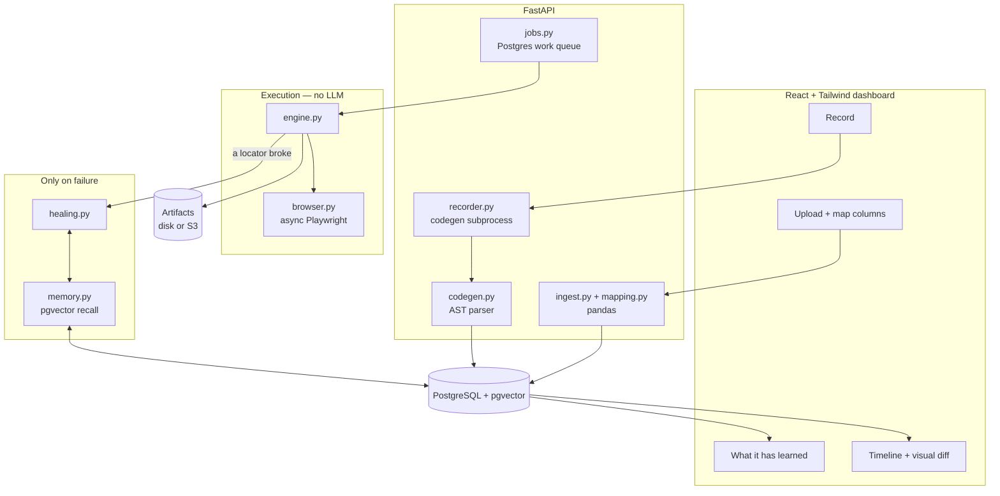

# Browser Automation

Record a browser workflow by doing it **once**, map a spreadsheet onto it, and
replay it over a thousand rows — **without an LLM in the loop**.

> Sign in to the supplier portal, open each order in this spreadsheet, and mark
> it dispatched.

You do that task by hand, in a real browser, one time. The software watches,
turns what you did into a reviewable list of steps, and from then on runs it
deterministically. A model is asked exactly two questions in the whole
lifecycle: *which column fills which field* when you upload a file, and *where
did this button go* when a site redesign breaks a step. Everything else costs
nothing.

Built as a foundation for internal data entry and QA automation, so the code
favours being obvious over being clever.

---

## Contents

- [Why it is built this way](#why-it-is-built-this-way)
- [Architecture](#architecture)
- [The data model](#the-data-model)
- [Prerequisites](#prerequisites)
- [Setup](#setup)
- [Running it](#running-it)
- [The workflow, end to end](#the-workflow-end-to-end)
- [Signing in and roles](#signing-in-and-roles)
- [Environment variables](#environment-variables)
- [The API](#the-api)
- [Guardrails](#guardrails)
- [Tests](#tests)
- [Deployment](#deployment)
- [Troubleshooting](#troubleshooting)
- [Project layout](#project-layout)

---

## Why it is built this way

This project used to record workflows with an **LLM agent**: you described a
task in English and a model drove the browser until it worked. That is the
right design for *figuring out* how to do something and the wrong one for doing
the same thing a thousand times.

The cost was measurable, from this repository's own data. One recorded workflow
— 35 steps — consumed roughly **247,000 input tokens**, because the agent
re-sends its history every turn and 87% of that history is accessibility
snapshots. It also failed 13 of its 34 browser actions on the way to succeeding.

The observation that replaced it: **the user already knows how to do the task.**
They do it every day. They do not need a model to discover it; they need the
software to watch them do it once.

So recording is now `playwright codegen` — a real browser, your hands, zero
tokens — and the resulting script is *parsed*, not interpreted. What remains of
the old design is the part that was always right: a use case is a durable,
parameterised list of steps that replays with no model at all.

For what is stored where -- every table, what it holds and why -- see
[`docs/design/data-model.md`](docs/design/data-model.md).

If you want the full reasoning, including the three things the design document
asserted that turned out to be wrong, read
[`docs/design/deterministic-automation-platform.md`](docs/design/deterministic-automation-platform.md).

---

## Architecture



**Three phases, and only one of them can spend money.**

| Phase | What happens | Model cost |
|---|---|---|
| **Record** | `playwright codegen` captures your session; `codegen.py` parses it | none |
| **Map** | Column names matched to fields by string handling and value shape | none, usually |
| **Replay** | `engine.py` drives Playwright directly, row after row | **none, ever** |
| **Heal** | Only when a locator stops matching, and only if enabled | one call, budgeted |

**The zero-token guarantee is structural, not a promise.** `engine.py` does not
import `llm`, `UseCaseExecutor` has no parameter that could accept a model
client, and a test asserts both. A healer is *injected*; with none passed there
is no code path to a model at all.

---

## The data model

Seventeen tables in one PostgreSQL schema, named by `DB_SCHEMA`. In brief:

| Group | Tables |
|---|---|
| Tenancy and identity | `workspaces`, `users`, `user_sessions`, `audit_log` |
| Authoring | `usecases`, `usecase_versions`, `targets`, `credentials` |
| Input data | `datasets` |
| Execution | `jobs`, `batches`, `executions`, `runs`, `events`, `run_steps`, `artifacts` |
| Learning | `healing_memory` |

The distinction worth knowing before you read any of it: **a batch is one press
of "run this against these rows", an execution is one row of it, and a run is
the live view of an execution.** One batch of 500 rows is 1 batch row, 500
executions and 500 runs.

[`docs/design/data-model.md`](docs/design/data-model.md) has the entity diagram,
every column that carries meaning, and the rules that apply across all of them
-- workspace scoping, which references deliberately have no foreign key, and
what is never stored.

---

## Prerequisites

**This runs on your machine.** Two processes — a Python API and a Vite dev
server — against a PostgreSQL you already have. No Docker is involved anywhere
in this section; there is a compose file, but it is an alternative for people
who would rather not install Postgres, not the intended path.

| Requirement | Version | Why |
|---|---|---|
| **Python** | 3.11+ (3.11–3.13 tested) | The backend. Uses `X \| Y` unions and `asyncio.timeout`. |
| **Node.js** | 20+ | Builds the frontend. **Not** needed to record — Playwright's Python package ships its own codegen. |
| **PostgreSQL** | 14+ (17/18 tested) | Everything: runs, use cases, credentials, the job queue, the event fan-out, and healing memory. |
| **pgvector** | any recent | The `vector` extension, for healing memory. Optional if you turn that off. |
| **AWS credentials** | — | Claude on Bedrock, for mapping and healing. No API key. |

Check what you have:

```bash
python --version && node --version && psql --version
```

**pgvector** — the extension must be available *on the server*:

```bash
psql -c "SELECT * FROM pg_available_extensions WHERE name = 'vector'"
```

If that returns a row, you are set — the migration runs `CREATE EXTENSION` for
you. If it returns nothing, pgvector is not installed server-side: on Windows
it comes with the EDB installer's StackBuilder, on macOS with
`brew install pgvector`, on Debian with `apt install postgresql-17-pgvector`.

You can also just skip it. Set `HEALING_MEMORY_ENABLED=false` and everything
works except recalling past fixes.

**AWS access** — the standard credential chain, so anything that works with the
AWS CLI works here:

```bash
aws sts get-caller-identity
```

The identity needs `bedrock:InvokeModel` on the repair model and, if healing
memory is on, on the Titan embedding model.

---

## Setup

Written out longhand, for a local PostgreSQL you already have. There is a
`Makefile` with the same commands if you have `make`, but nothing here depends
on it.

Paths below are Windows (`.venv/Scripts/...`). On macOS or Linux that is
`.venv/bin/...` throughout.

### 1. A database to point at

The application keeps its tables in a **named schema**, so it can share a
database with anything else you have without colliding. It creates the schema
itself; it does not create the database.

If your existing `postgres` database is fine, there is nothing to do here — pick
a schema name and put it in `DB_SCHEMA` at the next step. To keep it separate:

```bash
psql -U postgres -c "CREATE DATABASE browser_automation"
```

> Use a schema name nothing else has migrated. If you point this at a schema
> that another branch or project has already stamped, Alembic will refuse with
> `Can't locate revision identified by ...` — see Troubleshooting.

### 2. Configuration

```bash
cp .env.example .env
```

Then edit `.env`. For a local Postgres the whole of what you need is:

```ini
DB_HOST=localhost
DB_PORT=5432
DB_NAME=postgres            # or browser_automation, if you made one
DB_USER=postgres
DB_PASSWORD=your-password
DB_SCHEMA=automation        # any name nothing else has migrated
CREDENTIALS_KEY=            # generated below
```

Generate the key:

```bash
python -c "from cryptography.fernet import Fernet; print(Fernet.generate_key().decode())"
```

`CREDENTIALS_KEY` encrypts every stored site login. **Losing it makes every
saved credential unreadable; leaking it makes them all readable.**

### 3. Python

```bash
python -m venv .venv
```

```bash
.venv/Scripts/python -m pip install -r backend/requirements.txt
```

**Use the venv.** Installing these into a system Python will fight with whatever
else lives there — these pin `langchain-core`, `pydantic` and `boto3`, and pip
will happily upgrade them out from under your other projects.

### 4. The browser

Playwright's Python package wants a Chromium it registered itself, at a revision
that matches the installed version. A Chromium you already have — the browser,
or one installed for the Node packages — is not that:

```bash
.venv/Scripts/python -m playwright install chromium
```

It is a few hundred MB and it is idempotent, so running it when you already have
the right build costs nothing. One browser then serves both recording and
replay: codegen's output is what the parser reads, so the recorder and the
engine being the same Playwright is the point.

### 5. Create the tables

```bash
cd backend && ../.venv/Scripts/python -m alembic upgrade head
```

Run it **from `backend/`** — that is where `alembic.ini` lives. It creates the
schema named by `DB_SCHEMA`, every table in it, and the `vector` extension.

You should see seven migrations apply, ending with
`a step records where it happened`.

### 6. Frontend

```bash
cd frontend && npm install
```

---

## Running it

Two terminals, both on your machine.

**Terminal 1 — the API**, from `backend/`:

```bash
../.venv/Scripts/python serve.py
```

That is uvicorn, port 8000, with reloading -- and with two Windows constraints
resolved that cannot be resolved on the uvicorn command line at all.

Playwright launches its driver as a subprocess through asyncio, and on Windows
only a `ProactorEventLoop` can do that. uvicorn switches to a
`SelectorEventLoop` whenever `--reload` is set, so `uvicorn main:app --reload` is
the one command under which nothing can be recorded or replayed. But `--loop
none` alone trades that for something worse: uvicorn's reloader binds the
listening socket in the parent and hands it to the child, and on Windows an
inherited socket cannot be registered with the child's IOCP. Every accept then
fails with `[WinError 87] The parameter is incorrect` -- *after* "Application
startup complete", so the server looks up and answers nothing.

`serve.py` reloads a level up instead: `watchfiles` restarts the whole process,
and each new process binds its own socket in the loop that will use it. Nothing
is inherited and both constraints hold.

`HOST`, `PORT` and `RELOAD` override the defaults:

```bash
PORT=8002 RELOAD=false ../.venv/Scripts/python serve.py
```

If you do start uvicorn by hand, add `--loop none`. The API warns at startup when
the loop cannot launch a browser, and says the same thing again in the error, so
this is not a silent failure -- but it is an avoidable one.

Wait for `Application startup complete`. Check it:

```bash
curl http://127.0.0.1:8000/healthz
```

`"status": "ok"` means the database is reachable and Bedrock credentials
resolved. `"degraded"` with a 503 tells you which of the two is unhappy.

**Terminal 2 — the dashboard**, from `frontend/`:

```bash
npm run dev
```

Then open <http://localhost:5173>.

The dev server proxies `/api` and `/healthz` — WebSocket upgrade included — to
the backend, so the two are same-origin from the browser's point of view and
CORS never enters into it.

It reads the **same `.env` the backend does**, so the port lives in one place. To
move the API to 8002, set `PORT=8002` in `.env` and both follow; run uvicorn with
`--port 8002` to match. `FRONTEND_PORT` moves the dashboard the same way.

The API's first start prints a **one-time administrator password**. It is shown
once and never again — only its bcrypt hash is stored. Sign in with it, then
change it under your account.

### Batches, and the worker

Batches run on a durable Postgres queue rather than in the request that started
them, so a restart does not lose them. By default the API process also claims
that work (`WORKER_ENABLED=true`), which is what makes a single-machine install
work with nothing else running.

To separate them, set `WORKER_ENABLED=false` on the API and run, from `backend/`:

```bash
../.venv/Scripts/python -m worker
```

---

## The workflow, end to end

### 1. Record

**Record** → give a starting URL → a real browser window opens.

Do the task once, by hand. Sign in, fill the form, submit it. Then **close the
window** — that is how you finish. Nothing is sent to a model; your actions are
captured directly.

### 2. Say what you typed

The recording comes back with the values you typed. Name each one, and mark the
login as a **credential**:

- an **input** becomes a spreadsheet column — a different value per row;
- a **credential** is stored encrypted, entered once per session rather than
  once per row, and never written into the workflow itself.

That answer also decides the **setup/row split**: everything up to and including
the last step that types a credential is per-session sign-in; the rest is
per-row work. That is not pattern-matching on the word "login" — a credential is
by definition the value a person supplies once.

### 3. Review and publish

You get a **draft**. The split is a heuristic, the parameterisation is derived,
and the assertions are whatever you happened to record — so a person publishes
it. Drafts cannot run.

The draft carries warnings worth reading. The loudest: *nothing verifies that a
row succeeded*. Without an assertion, a batch of a thousand rows can fail
silently on row 12 and report success on all of them.

Lines the parser could not represent are listed rather than guessed at — a
chained locator, an iframe, a file upload. It refuses instead of approximating,
because the alternative is a step that clicks something *adjacent* on row one.

### 4. Upload data and confirm the mapping

Upload a CSV, Excel file or delimited text. It is parsed with pandas, profiled
(type, blanks, distinct values, examples) and stored.

Then confirm which column fills which field. Most of this is not a language
problem — exact names, token overlap, type compatibility, value shape — so a
well-named file maps for **zero tokens**, and the model is a fallback for what
stays ambiguous rather than the mechanism.

You confirm every mapping regardless. A mapping that is wrong and unreviewed
does not fail; it succeeds a thousand times into the wrong fields.

Values are never coerced on the way in. `0071` stays `0071`, a date stays the
text you wrote — a reader that helpfully parses those produces a thousand wrong
records and no error.

### 5. Run it

One row, or the whole file. Rows run in sequence on **one shared browser
session**, so the workflow signs in once. The recovery rules:

1. A failed row never aborts the batch by itself.
2. `row_reset` runs before every row.
3. If the session looks logged out between rows, setup re-runs **once**.
4. If that fails, stop. Remaining rows stay `pending`, never `failed` — they
   were not attempted, and saying otherwise would corrupt the results file.
5. Abort after N consecutive failures. Ten minutes of a broken selector failing
   400 rows is worse than stopping and telling someone.

### 6. Look at what happened

**Timeline** streams the run live. **Compare with last run** is the finished
article: every step as a row, with this run's screenshot beside the one from the
last run that worked, and a pixel-difference ratio.

It opens on the **first divergence** — the first step that failed or moved more
than a couple of percent — because "scroll until something looks wrong" is not a
workflow when a batch produces tens of thousands of steps.

The ratio is shown in words, and is not a verdict: a rendered clock changes a
few pixels and means nothing; a form that silently failed to submit can change
very few and mean everything.

> The baseline is the last **successful** run, not the recording. Codegen owns
> the browser during recording and we never see its pages, so there are no
> screenshots from that moment. "What changed since it last worked" is the more
> useful question anyway.

### 7. When a site changes

Sites get redesigned and locators stop matching. If healing is on
(`REPLAY_HEALING_ENABLED=true`), the model is shown the controls that are on the
page **now** and asked which one the step meant — it picks by index, so it
cannot invent a selector. A confident repair is applied, the row continues, and
the fix is written back as a new use case version.

Confirmed fixes are remembered against that site. The next time something breaks
there, past fixes go into the prompt as evidence — so one redesign costs one
model call across every workflow that hits it, rather than one per workflow.

When the model is not confident enough, the step fails and the trail offers a
box: *do you know what changed?* One sentence from you is stored as a
human-confirmed fix, and it outranks anything the model worked out alone.

**Learned** shows everything remembered, and lets you forget any of it. That
matters: a fix that was right last month and wrong now does not fail loudly — it
gets recalled as precedent and quietly makes the next repair worse.

---

## Signing in and roles

Local accounts with bcrypt hashes and bearer tokens. No SSO, by decision;
`auth/rbac.py` is free of HTTP and storage, so an OIDC provider would replace
how identity is *established* without touching what it *permits*.

| Role | Can |
|---|---|
| **viewer** | Read runs, use cases and results. Change nothing. |
| **operator** | Run things: execute, batch, cancel, save credentials. |
| **author** | All that, plus record, publish, repair and delete use cases. |
| **admin** | Everything, plus managing accounts, reading the audit log, and enabling script steps. |

Script execution is deliberately not an author's to grant. A `script` step runs
arbitrary JavaScript in a session that may be signed in, so the authority to
*write* a use case and the authority to let it *run code* are different
authorities.

Every workspace is a hard tenant boundary. Scoped operations live on
`WorkspaceStore`, not `Store`: forgetting the tenant filter is not possible,
because the scoped object has no method that can reach another tenant's row.

---

## Environment variables

Every setting is documented in [`.env.example`](.env.example), which is checked
against the settings model by a test — so it cannot drift. The ones you are most
likely to touch:

### The model

| Variable | Default | Notes |
|---|---|---|
| `LLM_REPAIR_MODEL` | a Claude inference profile | The only model role left. |
| `AWS_REGION`, `AWS_PROFILE` | unset | Usually best left to the credential chain. |

### Browser and recording

| Variable | Default | Notes |
|---|---|---|
| `BROWSER_ENGINE` | `chromium` | `firefox` and `webkit` also work. |
| `BROWSER_HEADLESS` | `true` | A single run can ask for a window per request. |
| `BROWSER_TRACE` | `false` | A Playwright trace per execution, kept as an artifact. |
| `RECORDER_ENABLED` | `true` | Set `false` where there is no display. |
| `RECORDER_COMMAND` | blank | Blank runs the Playwright installed here. |

### Replay and healing

| Variable | Default | Notes |
|---|---|---|
| `REPLAY_SCREENSHOTS` | `final` | `off`, `failure`, `final`, `every_step`. |
| `REPLAY_FAILURE_STREAK_LIMIT` | `5` | Consecutive failures before the batch stops. |
| `REPLAY_HEALING_ENABLED` | `false` | **Off by default: this is the one thing that spends tokens.** |
| `HEALING_MEMORY_ENABLED` | `true` | Needs pgvector. |
| `EMBEDDING_BACKEND` | `bedrock` | `hash` is a deterministic stand-in with no AWS. |

### Everything else

`DB_*` (note **`DB_SCHEMA`**, below), `WORKER_*`, `STORAGE_BACKEND` and `S3_*`,
`AUTH_*`, `BOOTSTRAP_*`, `LOG_*`, `CORS_ORIGINS`.

> **`DB_SCHEMA` is special.** SQLAlchemy binds the schema into the model
> metadata when the model classes are imported, before any settings object
> exists. It is read from the environment first and `.env` second, and the
> application refuses to start if the two disagree — because the alternative
> failure is silent and awful: tables created in one schema while queries read
> another.

---

## The API

Bearer token on every route except `/healthz` and `/api/auth/login`.

| Area | Endpoints |
|---|---|
| **Recording** | `POST /api/recordings`, `GET /api/recordings/{id}`, `POST /api/recordings/{id}/save`, `/cancel`, `DELETE` |
| **Use cases** | `GET/PUT/PATCH/DELETE /api/usecases/{id}`, `/publish`, `/repair`, `/scripts`, `/activity` |
| **Data** | `POST /api/datasets` (multipart), `GET /api/datasets`, `POST /api/usecases/{id}/mapping` |
| **Running** | `POST /api/usecases/{id}/execute`, `/batch`, `GET /api/batches/{id}`, `/resume`, `/cancel`, `/results.csv` |
| **Watching** | `GET /api/runs/{id}`, `/events`, `/steps`, `WS /api/runs/{id}/stream`, `GET /api/artifacts/{id}` |
| **Learning** | `GET/POST /api/memory`, `DELETE /api/memory/{id}` |
| **Admin** | `/api/auth/*`, `/api/admin/users`, `/api/admin/audit`, `/api/credentials` |

**Every event has a sequence number**, and that number is the resume token: a
dashboard that reconnects sends the highest `seq` it saw and the backend replays
exactly what was missed. No server-side session state, no lost steps.

Interactive docs at <http://localhost:8000/docs>.

---

## Guardrails

**The domain allowlist applies to every navigation.** A use case carries the
domains its recording visited, and a row whose input URL leaves them is refused.
This matters more than it sounds: a workflow whose input is a URL column takes
that URL from a spreadsheet, and a spreadsheet is untrusted input.

**Secrets never reach the event log.** Values are registered with a redactor
before anything is emitted, so a credential cannot leak even if a page echoes it
back. Batches take a stored credential id, never inline values — the worker that
runs them may be a different process, and carrying values would mean writing a
password into a table that a batch listing reads.

**A recorded script is data, never code.** Codegen output is parsed with `ast`
and never executed, `eval`'d or imported.

**Script steps are refused twice over.** A `script` step runs arbitrary
JavaScript in a session that may be signed in, so both the use case's own
`allow_scripts` *and* a separate admin-only flag on the resource must agree. An
author cannot grant themselves code execution by editing JSON.

**The model cannot invent a locator.** Healing and repair both present a
numbered list of controls actually on the page and take back an index. A
hallucinated selector has no route into something that runs unattended.

---

## Tests

```bash
cd backend && ../.venv/Scripts/python -m pytest -q
```

**655 tests: 644 run by default, 11 are skipped** because they need a real
browser (below). They want a running PostgreSQL and use their own schema
(`browser_test`), so they never touch your development data. Nothing in the
default run calls AWS or opens a browser.

The real-browser tests are opt-in, because they launch Chromium:

```bash
cd backend && RUN_E2E=1 ../.venv/Scripts/python -m pytest -q -m e2e
```

Those eleven are worth knowing about. They serve a two-page site from a temp
directory, record a codegen script against it, parse it, and replay it — nothing
stubbed. They check parameterisation per row, the setup/row split, locator
drift, assertions, extraction, screenshots, traces and the allowlist. Writing
them found three things the design document had asserted and should not have.

Frontend:

```bash
cd frontend && npm run typecheck && npm run build
```

---

## Deployment

Nothing above needs any of this — the local setup is the whole product, and a
single machine runs batches perfectly well.

**Docker**, if you would rather not install Postgres: `docker compose up --build`
brings up Postgres-with-pgvector, the backend and the dashboard together.
Recording does not work there — a codegen window needs a display and a container
has none.

For EKS, see [`deploy/README.md`](deploy/README.md): the API behind an ALB,
workers scaled from zero by KEDA on queue depth, Aurora with pgvector, artifacts
in S3. **Recording is disabled there** — a codegen window needs a display, so
workflows are recorded on a laptop and run anywhere.

> Those manifests are validated YAML with conventional shapes, but they have not
> been run on a cluster. The ARNs and endpoints are placeholders.

---

## Troubleshooting

### `Configured db_schema is 'x' but the models were built for 'y'`

`DB_SCHEMA` is read when the model classes are imported — environment variable
first, `.env` second. This means the two disagree. Either a stray `DB_SCHEMA` in
your shell is overriding the file, or a `Settings` was constructed with a
different schema than the file says.

### `Can't locate revision identified by '...'`

The schema was migrated by a **different branch** whose migration chain this one
does not contain. Alembic is not confused; the two histories genuinely diverge.
Point `DB_SCHEMA` at a fresh schema, or merge the lineages deliberately.

### `The 'vector' extension is not available on this PostgreSQL server`

pgvector is not installed server-side. Install it, use the `pgvector/pgvector`
image, or set `HEALING_MEMORY_ENABLED=false`.

### `Executable doesn't exist at ...` when a run starts

The browser binary is missing or is the wrong revision:

```bash
.venv/Scripts/python -m playwright install chromium
```

If it persists after a `playwright` upgrade, the pin in `requirements.txt` moved
and the browser did not — run that command again.

### Recording answers 501

`RECORDER_ENABLED=false`, which is correct anywhere without a display. Record
locally.

### The recording window opens but nothing is captured

Close the window to finish — that is the signal. Closing it immediately, or
killing the process, leaves nothing to parse and the recording reports that it
wrote nothing.

### A batch is queued and nothing runs it

Nothing is claiming work. Either `WORKER_ENABLED=false` with no separate worker
running, or the worker cannot reach the database. `GET /healthz` reports queue
depth.

### `AccessDeniedException` on the model

The account lacks that model. Request access in the Bedrock console — note the
error names the ID with its region prefix **stripped**, so it looks like an ID
you never configured. `GET /healthz?deep=1` checks it directly.

### A run is stuck in `running` after a crash

Startup reaps orphaned runs and reclaims expired job leases, so restarting the
backend fixes it. A worker that dies mid-batch releases its lease and another
picks the work up.

---

## Project layout

```
backend/
  main.py            FastAPI assembly — wiring, nothing else
  routers/           One module per resource
  recorder.py        The codegen subprocess
  codegen.py         Parses what it writes. Never executes it.
  ingest.py          CSV/Excel/text → rows + column profiles (pandas)
  mapping.py         Columns → declared fields, heuristics first
  usecase.py         The UseCase schema — the contract between phases
  engine.py          Executes a use case. No LLM, ever.
  browser.py         Playwright: one browser, one context, one page
  batch.py           Rows in sequence, and the recovery rules
  jobs.py            Durable work queue on Postgres
  worker.py          A batch worker with no HTTP attached
  healing.py         Repairs one locator, budgeted, off by default
  memory.py          What broke before and what fixed it (pgvector)
  embeddings.py      Titan, or a deterministic stand-in
  imagediff.py       How much two screenshots differ
  repair.py          Post-mortem repair of a failed use case
  store.py           Persistence. Tenancy enforced by construction.
  policy.py          The domain allowlist
  redaction.py       Secrets never reach the event log
  migrations/        Alembic
  tests/             655 tests, 11 of them opt-in
frontend/src/
  components/        RecordWorkflow, DatasetMapper, StepTrail, HealingMemory…
  lib/               API client, event types, run stream
deploy/              EKS manifests and their reasoning
docs/design/         Why it is shaped this way, and the data model
```

### Logs

Structured JSON on stdout, with `run_id` bound to every line inside a run. Set
`LOG_TO_FILE=true` for a rotating file as well; leave it off in a container,
where logs belong to the collector rather than to a disk that disappears.

---

## Responsible use

This drives a real browser as a real user. Automating a site you are not
authorised to automate is your responsibility, not the tool's. The domain
allowlist exists to make the boundary explicit and enforceable; it is not a
substitute for having permission.

Credentials are encrypted at rest with a key you supply. It is a static key with
no rotation story — moving to KMS envelope encryption is the outstanding item
**A4** in [`TODO.md`](TODO.md), and worth doing before this holds anything you
would mind losing.
