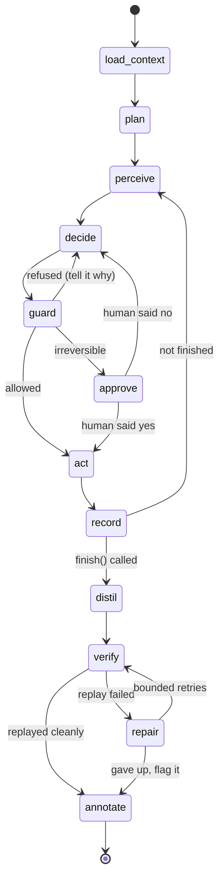
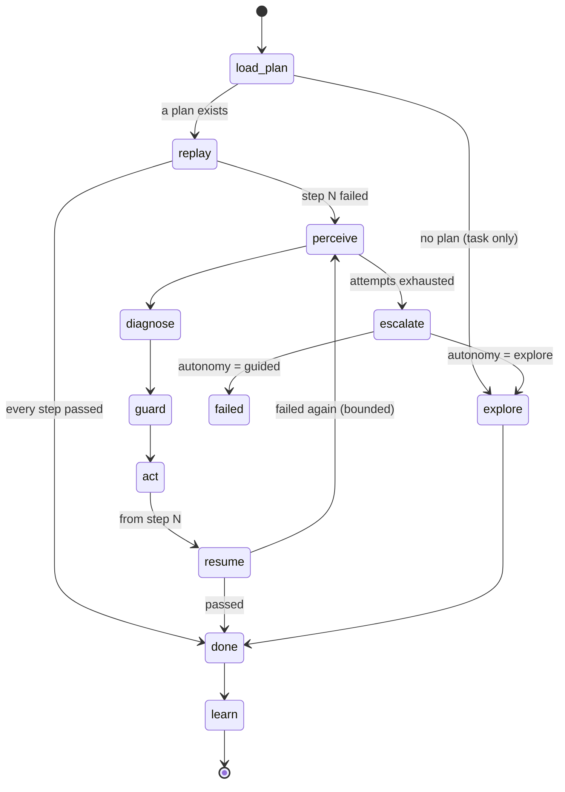

# Both capabilities: an agent that explores, an engine that repeats

Record a workflow with `playwright codegen` **or** with an AI agent. Run it with
the deterministic engine **or** with an AI agent. Four combinations, one
artifact between them, and a bridge that turns the expensive one into the free
one.

This document is the design. No code has been written for it.

---

## 0. What changed in this revision, and why

An earlier draft of this document argued **against** putting the browser behind
MCP, on the grounds that the platform had already removed that hop: a JSON-RPC
round trip to a Node process that then calls Playwright is a translation layer
between us and the library we want, and it cost auto-waiting, locator
strictness and traces.

That argument was correct **for the replay engine**, and it still is —
`engine.py` keeps talking to Playwright directly. It is the wrong argument for
the *agent*, and three things changed my mind:

1. **AgentCore makes MCP the native shape.** If the agent is to run on Bedrock
   AgentCore, its tools reach it through Gateway as MCP and its browser is a
   managed CDP endpoint rather than a process we own. Building a bespoke tool
   protocol now means porting it later.
2. **Playwright MCP hands back a durable locator for free.** It drives the
   *accessibility tree*, and when a call names an element by a handle from a
   snapshot (`e12`) the server replies with the Playwright code it ran —
   `page.getByRole('button', { name: '+ Invite User' })`. That is a
   role-and-name locator produced by the thing that just resolved it, which is
   most of what distillation needs.

   > **Corrected while building phase B.** An earlier version of this point
   > claimed the protocol *enforced* "the model can never invent a locator",
   > because the model picks an opaque handle out of a snapshot. Probing a real
   > server showed otherwise: `browser_click`'s `target` is documented as
   > "Exact target element reference from the page snapshot, **or a unique
   > element selector**", and passing `#o` clicks the element. The property is
   > not free. `guard` restores it by refusing any target that is not
   > `eN`-shaped and present in what the page last reported — which also
   > protects the durable-locator reply above, since a raw selector is only
   > echoed back.
3. **The step vocabulary is already Playwright MCP's vocabulary.** Read the
   comment above `ELEMENT_ACTIONS` in `usecase.py` — it explains `press` and
   `upload` in terms of `browser_press_key` and `browser_file_upload`. The
   action names in the `UseCase` schema are the fossil record of the original
   MCP design. Distillation from MCP tool calls is therefore close to a rename.

So: **the agent talks to the browser over Playwright MCP; the engine does not.**
Two different jobs, two different couplings, and the boundary between them is
the `UseCase` document.

The other two changes: the agent is a **LangGraph** graph, targeting AgentCore
Runtime; and loop detection in distillation — sized "L, the hard one" in the
previous draft — is **replaced by declaration**, which removes most of it. See
§6.

---

## 1. The shape of the answer

Two independent axes. Every useful thing is a pairing of one from each.

|  | **Authored by a person** | **Authored by an agent** |
|---|---|---|
| **Run deterministically** | Today. Record with codegen, replay free, forever. | **The valuable new one.** Agent explores once; its trajectory becomes a `UseCase`; 4,000 rows replay at zero token cost. |
| **Run by an agent** | A recorded flow whose site changes constantly, run adaptively. | One-off or highly dynamic work. Expensive per row, and honest about it. |

Authoring and execution are separate choices. That is the whole design in one
sentence.

### Three autonomy levels, and only one of them is really "an agent"

| Level | Model runs | Cost per row | What it is |
|---|---|---|---|
| **Strict** | Never | Zero | `engine.py` follows the plan. Today's behaviour. |
| **Guided** | Only when a step fails | Zero on a good row | The plan runs; the agent is a **supervisor** that wakes on failure, repairs one step, and hands control back. |
| **Explore** | Every decision | Full | No plan, or the plan no longer applies. The agent works the task out from the page. |

**Guided is the default for "run with AI", and this is the most important
decision in the document.** An agent that re-derives every click on every row
is a per-row bill and a thousand chances to improvise. An agent whose first
action is *"execute the recorded plan"* costs nothing on a good row, produces
identical results, and is still an agent when the site breaks.

That is what "as deterministic as possible, with an AI agent" means concretely:
the model is not in the loop, it is *on call*.

---

## 2. The invariant this must not break

> **`engine.py` must never import `llm`.** Two tests assert the absence of that
> import in the source, and `UseCaseExecutor.__init__` has no parameter that
> could accept a model client.

That is the only mechanical guarantee in the system, and it is why a Strict
batch cannot silently cost money. An agent implemented as a branch *inside* the
engine would destroy it.

So the agent is a **separate process boundary** that *calls* the engine, never
the other way round:

```
┌───────────────────────────────────────────────────────────────────┐
│  agent/ (LangGraph)          MCP client ──▶ Playwright MCP ──▶ 🌐  │
│    author_graph                                                    │
│    operate_graph  ──── calls ────┐                                 │
└──────────────────────────────────┼─────────────────────────────────┘
                                   │  replay(usecase, row)
                       ┌───────────▼────────────┐
                       │  engine.py             │  no llm, by construction
                       │  UseCaseExecutor       │  drives Playwright directly
                       └───────────┬────────────┘
                       ┌───────────▼────────────┐
                       │ events · run_steps ·   │  one audit trail,
                       │ artifacts · executions │  whichever drove it
                       └────────────────────────┘
```

The engine never learns that an agent exists. The agent knows the engine
intimately — it is the agent's most-used tool.

---

## 3. The two graphs

Both are LangGraph `StateGraph`s over a shared tool layer and a shared
checkpointer. Nodes marked **⬤ model** are the only places a token is spent.
Everything else is code.

### 3.1 The author graph — "record with AI"



| Node | Model? | What it does |
|---|---|---|
| `load_context` | | Target URL, credential slots, dataset sample row, prior use cases on this domain. |
| `plan` | ⬤ | One call. Produces an *outline* — the phases it expects (sign in, search, open record, read fields). Not steps; a map to notice deviation against. |
| `perceive` | | `browser_snapshot` via MCP. Accessibility tree with refs. Deterministic. |
| `decide` | ⬤ | One tool call, chosen from the registry. Temperature 0. |
| `guard` | | Schema validation, domain allowlist, write-gate, budget, irreversibility classification. **Server-side, never the model's judgement.** |
| `approve` | | LangGraph `interrupt()`. The human-in-the-loop rendezvous. |
| `act` | | Dispatch the tool. Deterministic. |
| `record` | | Append to trajectory, emit the same event types a replay emits. |
| `distil` | | Trajectory → draft `UseCase`. Mechanical (§6). |
| `verify` | | **Run the draft through `engine.py`, in the same browser session, against the same row.** Deterministic. |
| `repair` | ⬤ | Only if verification failed. Sees the failing step and a numbered candidate list. |
| `annotate` | | Attach the verification report, cost, and trajectory to the draft. |

**`verify` is the node that makes this trustworthy.** The agent does not get to
*claim* it recorded something. The distilled artifact is replayed by the
engine — the same code that will run the 4,000 rows — and a draft that does not
replay is a draft that says so, on the review screen, before anyone publishes
it.

### 3.2 The operate graph — "run with AI"



The happy path is `load_plan → replay → done → learn` and contains **no model
call at all**. A 4,000-row batch in Guided mode where the site behaves costs
exactly what a Strict batch costs: nothing.

`learn` writes what the repair found into `healing_memory` — the pgvector
recall that already exists — so the same site change costs one model call
across the whole batch rather than one per row.

### 3.3 The determinism ledger

Worth stating as a number, because "as deterministic as possible" is otherwise
a feeling:

| Graph | Nodes | Model nodes | Model calls on a clean run |
|---|---|---|---|
| Author | 11 | 3 | 1 + one per action taken |
| Operate (Guided) | 10 | 1 | **0** |
| Operate (Explore) | 10 | 1 | one per action taken |

Everything the model produces is additionally constrained:

- It chooses a **tool from a fixed registry**, validated against a JSON schema.
- It refers to elements by **opaque ref**, never a selector it composed.
- When repairing, it picks an **index into a numbered list** of controls that
  are actually on the page — the pattern `healing.py` already uses.
- Temperature 0, and the prompt is a file in `backend/prompts/`, per the
  existing rule that no prompt is ever an inline string.

### 3.4 Checkpointing, interrupts, streaming

- **Checkpointer:** LangGraph's Postgres saver, on our existing database. It is
  already a dependency (`psycopg` is in `requirements.txt` for Alembic, and the
  comment there still says "it is also what LangGraph's Postgres checkpointer
  uses" — a leftover that becomes true again).
- **Interrupts:** `interrupt()` at the `approve` node. This is how the
  long-defined-but-unused `RUN_APPROVE` permission finally gets used, and it is
  the same rendezvous whether the human is at a browser or the run is resumed
  hours later from a checkpoint.
- **Streaming:** LangGraph's event stream is adapted into the **existing**
  `events` table and `LISTEN/NOTIFY` bus. Agent runs appear in the same live
  view, with the same sequence-number resume token, as replays. No second
  streaming path.

---

## 4. The tool surface

### 4.1 From Playwright MCP, taken as-is

| MCP tool | Distils to |
|---|---|
| `browser_navigate`, `browser_navigate_back` | `navigate` |
| `browser_snapshot` | *(perception only — dropped)* |
| `browser_click` | `click` |
| `browser_type`, `browser_fill_form` | `fill`, `fill_form` |
| `browser_select_option` | `select` |
| `browser_press_key` | `press` |
| `browser_hover` | `hover` |
| `browser_file_upload` | `upload` |
| `browser_wait_for` | `wait` |
| `browser_take_screenshot` | *(artifact — dropped)* |
| `browser_handle_dialog`, `browser_tabs` | *(session control — dropped)* |
| `browser_console_messages`, `browser_network_requests` | *(diagnosis — dropped)* |

The left column is not a coincidence; see §0.3.

### 4.2 Refused, and not merely discouraged

Removed from the list the model is shown, rather than forbidden in a prompt. A
tool absent from the list cannot be called by a model that decides the rules do
not apply to it; a prompt saying "do not use `browser_evaluate`" is a request.

- **`browser_evaluate`** and **`browser_run_code_unsafe`.** Arbitrary
  JavaScript and arbitrary Playwright code against a live session that may hold
  someone else's credentials. `allow_scripts` is a privileged grant to a
  *reviewed* recording; an agent that can write either at run time makes that
  gate decorative.
- **`browser_close`.** The session's lifetime belongs to the caller.
- **`browser_drag` / `browser_drop`**, for now: not expressible as a step, so
  they could not be distilled.
- **A `target` that is not a ref.** See the correction in —0.2 — the
  protocol accepts a raw selector there and this does not.
- **Navigation outside the allowlist.** Enforced in `guard` on *every* call
  rather than on a navigation tool by name, because a tool we have never seen
  could still take a URL. Refused as a tool error with an audit entry — never
  as an instruction the model is asked to obey.

### 4.3 The tools we add, and why each one earns its place

These are the difference between an agent that *does* a task and an agent that
*records* one. Playwright MCP gives neither.

**`describe_element(ref) → LocatorLadder`** — **the single most important
addition.** An MCP `ref` is valid for one snapshot; a `UseCase` needs a locator
valid next year. This resolves a ref into the ranked ladder the platform
already understands — role + accessible name (with `exact` set correctly),
label, placeholder, test id, css — *and reports how many elements each rung
matches*, so an ambiguous rung is caught while the agent is still looking at the
page rather than 4,000 rows later. Without this tool there is no distillation.

**`mark_setup_complete()`** — everything before this is `setup_steps`, run once
per batch; everything after is `row_steps`. Sign-in must not run per row, and
the agent is the only thing that knows where sign-in ended.

**`begin_row(key)` / `end_row()`** — the agent declares the repeating unit.
This is what replaces loop detection. See §6.

**`mark_as_input(ref, name)`** — "this value changes per row." Becomes a
declared input and a `{{input.name}}` template.

**`mark_as_output(ref, column)`** — "this value goes in the spreadsheet."
Becomes an `extract` step. Deliberately the same gesture a person makes with
the recorder's *Assert value* button, so both authoring paths produce the same
thing.

**`mark_as_secret(ref, slot)`** — "this is a credential." Binds to a stored
credential slot; the value never enters the transcript.

**`extract_table(ref, columns)`** — becomes `extract_rows`. The discovery pass
for a migration.

**`download(ref)`** — becomes `download`.

**`replay_steps(from, to)`** — executes an already-known-good sub-sequence
through `engine.py`. In the operate graph this is the agent's *first* action,
not a fallback. In the author graph it is how the agent re-reaches a page after
a dead end without spending tokens retracing.

**`list_candidates(intent) → [numbered controls]`** — the repair primitive.
The model returns an index. It never returns a selector.

**`ask_human(question)`** — `interrupt()`. For approval and for genuine
ambiguity ("there are two accounts matching Smith").

**`finish(status, outputs)`** — terminal. Explicit, so a trajectory has an end
rather than a budget exhaustion.

### 4.4 MCP servers as an extension point

The tool registry mounts additional MCP servers per workspace — a ticketing
system, a file store, an internal API — with their own allowlist and their own
audit. This is where third-party tooling belongs, and it is free once the agent
already speaks MCP.

---

## 5. The deterministic language

> *"one agent can decide to build a deterministic type of instructions in any
> language you choose which can be understood by other agent to run it
> deterministically"*

**The language is the `UseCase` JSON document, and choosing anything else would
be a mistake.** It already has:

- a schema with a validator that **refuses** malformed plans — so the agent's
  output is checked by code, not by another model;
- a locator ladder with fallbacks and drift reporting;
- the `setup` / `row` / `reset` split that makes a batch share one session;
- templating confined to value-bearing fields, with locator templating rejected;
- versioning, promotion across dev/UAT/prod, and healing memory;
- an executor that provably cannot call a model.

A new DSL would need every one of those built again. The correct move is to add
three fields to the document, not to invent a second one:

```jsonc
{
  "name": "Pull statements",
  "authored_by": "agent",              // new: "person" | "agent"
  "mode": "guided",                    // new: strict | guided | explore
  "task": "For the account in this row, open it and download the latest statement.",
  "budget": { "steps": 40, "tokens": 60000, "seconds": 300, "usd": 0.50 },
  "provenance": {                      // new: how this document came to exist
    "trajectory_id": "...",
    "verified": true,
    "verified_at": "2026-09-06T14:00:00Z",
    "model": "claude-sonnet-5"
  },
  "setup_steps": [ /* … unchanged … */ ],
  "row_steps":   [ /* … unchanged … */ ]
}
```

`task` is what the *other* agent reads when a step fails and it has to work out
what the step was for. That is the "understood by another agent" requirement,
and it is satisfied by one string field beside a fully specified plan — not by
replacing the plan with prose.

**`runs.task` stops being vestigial.** The column already exists, holds a
natural-language instruction, and is currently written as a synthetic label
(`"Replay: <name>"`). For an agent run it becomes what it was built for.

---

## 6. Distillation by declaration

The previous draft sized loop detection as **L, "the hard, valuable one"** —
recognising a repeated shape across 400 near-identical sub-trajectories and
inferring the row boundary and the varying value.

**Do not infer what the agent can declare.** `begin_row(key)` / `end_row()` and
`mark_setup_complete()` turn that inference problem into bookkeeping:

| Trajectory | Becomes |
|---|---|
| everything before `mark_setup_complete` | `setup_steps` |
| the span between `begin_row` and `end_row` | `row_steps`, **once** |
| second and later `begin_row` spans | verification samples, not steps |
| `mark_as_input(ref, "account")` inside the span | a declared input; the `fill` becomes `{{input.account}}` |
| `mark_as_output(ref, "balance")` | an `extract` step at that position |
| `browser_snapshot`, `wait_for`, retries, dead ends | dropped — how it *found* the way, not the way |

The second and later row spans are the gift: if the agent ran three records,
distillation has **three independent samples of the same shape**, which is
enough to check that the steps really are identical and that exactly the marked
values differ. A span that does not match the first is a warning on the review
screen, not a silent guess.

The prompt makes declaring these mandatory before `finish` is accepted. An
agent that forgets is told to go back, by the guard, deterministically.

---

## 7. Where each capability runs

Local recording must keep working, AgentCore must become an option, and
everything that works today must keep working. That is three requirements, and
they are compatible because **this platform is already split into roles** —
`RECORDER_ENABLED` and `WORKER_ENABLED` exist precisely because recording needs
a display and replay does not. The agent is a **third role**, not a new concept.

### 7.1 The four roles

| Role | Switch | Needs | Laptop | Your cluster | AgentCore |
|---|---|---|---|---|---|
| **api** | always on | Postgres | ✅ | ✅ `api.yaml` | ✗ |
| **replay worker** | `WORKER_ENABLED` | headless Chromium | ✅ | ✅ `worker.yaml` | ✗ |
| **recorder** (codegen) | `RECORDER_ENABLED` | headed Chromium **+ a display** | ✅ **only here** | ✗ | ✗ |
| **agent** | `AGENT_ENABLED` | a browser (own or remote), Node + MCP, Bedrock | ✅ | ✅ new `agent.yaml` | ✅ |

**Recording with codegen does not move, and nothing in this design touches it.**
`recorder.py`, `codegen.py`, the parser and the review screen are unchanged. It
needs a real window on a machine with a display; that is why the container sets
`RECORDER_ENABLED=false` and answers 501 rather than failing at spawn with an
X11 error. An agent-authored use case lands in **the same review screen** and
produces **the same document** — which is the entire point of the fork.

So the shape people will actually use is the one that already exists:

> **Record on a laptop. Publish. Run in the cloud.**
> Now with a second way to record on that laptop, and a third place to run.

### 7.2 One entry point, three transports

```python
async def run_agent_session(request: AgentRequest, sink: EventSink) -> AgentResult
```

| `AGENT_TRANSPORT` | What it is | When |
|---|---|---|
| `inprocess` | Same process as the API, like `WORKER_ENABLED=true` today | Laptop; single-machine install |
| `worker` | Your own container, claiming from the durable job queue the batches already use | Your cluster; when the target or the secret must not leave your network |
| `agentcore` | Invoke AgentCore Runtime, read the streamed events, persist them here | Scale, isolation, no cluster to run |

**The agent never writes to Postgres.** It emits events into a sink. In-process
the sink is `RunEventSink` writing straight through; over AgentCore the sink is
the streaming response and *our* API does the writing. Same event types, same
sequence numbers, same resume token, same run view — which is what keeps one
audit trail across three topologies.

### 7.3 The browser is not always ours

Locally, Playwright MCP is `npx @playwright/mcp` launching its own Chromium. On
AgentCore, the browser is a managed session reached over a CDP endpoint. One
interface, and the seam is that Playwright MCP can *attach* to an existing
browser rather than launch one:

```python
class BrowserProvider(Protocol):
    async def open(self) -> MCPSession: ...
    async def close(self) -> None: ...

class LocalPlaywrightMCP(BrowserProvider): ...   # npx, stdio, own Chromium
class AgentCoreBrowser(BrowserProvider): ...     # managed session, CDP endpoint
```

Get this right on day one and AgentCore is configuration. Get it wrong and it is
a rewrite. Note this is the *agent's* browser only — `engine.py` keeps driving
Playwright directly, for auto-waiting, locator strictness and traces.

| Concern | Laptop / your cluster | AgentCore |
|---|---|---|
| Agent process | in-process or your worker | Runtime container: ARM64, `POST /invocations` + `GET /ping` |
| Browser | `npx @playwright/mcp` | AgentCore **Browser** over CDP |
| Third-party tools | MCP servers over stdio | AgentCore **Gateway** (MCP-native) |
| Checkpoints | LangGraph Postgres saver | same saver, or AgentCore **Memory** |
| Credentials | Fernet in `credentials` | AgentCore **Identity**, or passed per invocation |
| Traces | our `events` table | OTEL → Observability, **plus** our events |

Two rules keep the port cheap:

1. **The agent package imports nothing from FastAPI and nothing from `store.py`.**
   Its entry point takes a request and yields events; every HTTP surface — ours
   today, AgentCore's later — is a thin adapter over it.
2. **Our `events` table stays the system of record**, even when Observability is
   also collecting traces. The run view, the resume token and the compliance
   story are built on it; a managed observability product is a debugging aid.

### 7.4 Two constraints that choose the topology for you

**Reachability.** AgentCore's browser runs in AWS. If the target is only
reachable from inside your network — a UAT box on a private subnet, an on-prem
vendor portal — that browser cannot see it, and the agent has to run in your own
cluster on the `worker` transport. Check this per target *before* choosing; it
is not a tuning decision, it is whether the thing works at all.

**Where the secret travels.** Running on AgentCore means a decrypted credential
crosses into a managed runtime for the length of a session. Today it never
leaves your process. Where that is unacceptable, pin the workspace to `worker`.
This belongs as a **per-workspace** setting, not a global one — a platform with
both a public vendor portal and an internal system will want both answers.

### 7.5 Images: do not grow the one that runs the batches

| Image | Contents | Base |
|---|---|---|
| `runtime` *(today's)* | API + `engine.py` + replay. No Node, no LangGraph. **Unchanged.** | `mcr.microsoft.com/playwright/python` |
| `agent` *(new)* | Adds Node, a pinned `@playwright/mcp`, LangGraph. Also built ARM64, because that is what AgentCore Runtime takes. | same base |

And the dependencies follow: **LangGraph and the MCP client go in
`requirements-agent.txt`, not `requirements.txt`.** With them absent the
platform is exactly today's platform and `AGENT_ENABLED` answers 501 the way
`RECORDER_ENABLED` already does. That is the mechanism that makes "what works
keeps working" true rather than hoped for — and it is the opposite call from
`boto3`, which is a hard dependency because a missing package discovered on the
first screenshot of a production run is a bad trade. A missing agent is
discovered on a screen that says the agent is not enabled here.

> Verify the AgentCore surface (container contract, browser endpoint shape,
> Gateway semantics) against current AWS documentation at implementation time.
> The design isolates every one of those behind an interface precisely because
> they are the parts most likely to have moved.

---

## 8. The compatibility contract

Everything below is a property to hold, and most of them are already testable.

- **Every stored `UseCase` validates unchanged.** New fields are optional:
  `mode` defaults to `strict`, `authored_by` to `person`, `provenance` to null.
  An upgrade changes no behaviour for anything already published.
- **`engine.py` still never imports `llm`,** and `UseCaseExecutor.__init__`
  still has no parameter that could accept a model client. Both existing tests
  keep asserting it. The agent *calls* the engine; the engine gains nothing.
- **Strict replay is the same code path it is today.** A Strict batch cannot
  cost a token, by construction rather than by configuration.
- **`playwright codegen` recording is untouched** — the recorder, the parser,
  the "What did you type?" and "What should it read?" review, all of it.
- **A `UseCase` replays without its trajectory.** Provenance is evidence, not a
  dependency, so a document recorded on a laptop and imported to production
  runs there with nothing else carried across. This is what keeps promotion
  working across the three topologies.
- **Events, sequence numbers and the resume token are unchanged.** An agent run
  appears in the existing run view and the existing live stream.
- **Batches, targets, promotion, credentials, healing memory, RBAC and the
  audit log are unchanged**, and an agent run writes the same `run_steps` rows a
  replay does.
- **`RECORDER_ENABLED=false` deployments behave exactly as they do now.**
- **With the agent extras uninstalled, nothing imports LangGraph or MCP at
  module scope** — worth a test of its own, in the spirit of the two that guard
  `engine.py`.

One piece of housekeeping this makes relevant: `data/checkpoints.sqlite` is a
leftover from the LangGraph checkpointer that was removed. It should be deleted
now and re-created, if at all, in Postgres.

---

## 9. Safety, and cost

Agent mode is materially more dangerous than replay. The design answers that
rather than assuming goodwill.

- **The allowlist binds in `guard`,** not in the prompt. A model asking to leave
  the allowed domains gets a refused tool call and an audit entry.
- **Read-only by default.** Write tools are gated by an explicit *"let it
  write"* choice on the session.
- **Irreversible actions stop and ask.** Submit, delete, pay, send. Classified
  in code from the resolved element's role and accessible name — not by asking
  the model whether it thinks its own next action is dangerous.
- **Credentials never enter the context window.** The model sees
  `{{secret.password}}`; the tool layer substitutes after the model has spoken.
  This is how replay already works and must not regress.
- **Every tool call is audited**, arguments redacted through the existing
  `Redactor`, which must be registered with the secret *before* the first event
  is emitted — an existing invariant that applies unchanged.
- **Budgets are enforced server-side**: steps, tokens, wall clock, dollars.
  Checked in `guard`, before every model call and every tool call.
- **A batch has a hard cost cap.** An agent loop over a spreadsheet is the
  single easiest way to spend a lot of money in this product. Not optional.

And the product should argue for the cheap path with the user's own data:

> *This use case has run 1,240 rows in Strict without a failure. Explore mode
> would have cost about $99.*

That line is derivable from `executions` today.

---

## 10. Data model additions

| Table | Change |
|---|---|
| `usecases` | `mode`, `authored_by` — mirrored from the definition like `target` |
| `executions` | `mode`, `cost_usd` (`llm_calls` / `llm_tokens` already exist) |
| `batches` | `mode`, `cost_cap_usd`, `cost_usd` |
| `agent_sessions` | **New.** An authoring session: task, target, status, budget, cost, verification outcome |
| `trajectory_steps` | **New.** One row per tool call — tool, arguments, ref, resolved locator ladder, page URL, outcome, tokens. The input to distillation and the evidence for an audit |
| `workspaces` | `monthly_token_ceiling` |

`trajectory_steps` is deliberately a table and not a JSON blob on the session:
it is queried ("show me every time an agent clicked Submit on this domain"),
and it is the thing a compliance reviewer asks for.

---

## 11. Phasing and size

Relative sizes, one person who knows this codebase. S ≈ a day or two, M ≈ a
week, L ≈ two or three, XL ≈ more.

| | Phase | Size | Ships what |
|---|---|---|---|
| **A** | **Make the mode visible.** `mode` on the use case, the "How it runs" card, healing per use case rather than per deployment. | **S** | Guided mode already exists as `REPLAY_HEALING_ENABLED` and nobody can see it. Free value, no agent. |
| **B** | **MCP client + tool registry + the role.** `BrowserProvider`, Playwright MCP over stdio, schema-validated dispatch, allowlist and redaction in `guard`, audit per call. Plus `AGENT_ENABLED`, `requirements-agent.txt` and the `run_agent_session` entry point on the `inprocess` transport. No agent yet. | **M** | Testable on its own, and the point at which "without the extras this is today's platform" becomes a property rather than an intention. |
| **C** | **`describe_element` and the marking tools.** The ref → ladder bridge, `mark_*`, `begin_row`. | **M** | The part that makes recording possible rather than just doing. |
| **D** | **The author graph.** LangGraph, checkpointer, budgets, cancel, `interrupt()` approval, events into the existing stream. | **L** | An agent that can drive a browser and be watched. |
| **E** | **Distillation + `verify`.** Trajectory → draft `UseCase`, replayed through `engine.py`, landing in the existing review screen. | **M** | **The bridge. Everything before this is a browser-using chatbot.** |
| **F** | **Agent authoring UI.** The fork screen, the two-pane session, live transcript, save-as-use-case. | **M** | |
| **G** | **The operate graph, Guided.** Replay-first, repair on failure, resume, `learn` into healing memory. | **M** | "Run with AI" that costs nothing on a good row. |
| **H** | **Explore mode + cost governance.** Per-row agent execution, estimates, hard caps, workspace ceilings. | **M** | |
| **I** | **Remote transports.** The `agent` image (Node + `@playwright/mcp`, ARM64 too), the `worker` transport on the existing job queue, then AgentCore: `/invocations` + `/ping`, `AgentCoreBrowser`, Gateway, OTEL. Per-workspace transport. | **M** | Both remote answers, and the choice between them (§7.4). Small if B built its interface properly. |

**No phase modifies `recorder.py`, `codegen.py` or `engine.py`.** The
compatibility contract in §8 is the acceptance criterion for every one of
them, and local codegen recording keeps working throughout — including for
somebody whose deployment never enables the agent at all.

**Rough total: 9–13 weeks.** A–G (≈ 7–9 weeks) is a coherent, shippable product:
*describe a task, watch it work, save it as a use case, replay it free, and have
it repair itself when the site moves.*

### The order I would actually ship in

1. **A alone, first.** Let people use Guided. It will tell you how much of the
   demand for "an agent" is really demand for "cope with a site that changed".
2. **B → C → D → E** as one arc, ending at a verified draft use case.
3. **G before H.** Offer agent *execution* only once it can be offered beside a
   cheaper alternative, not as the only way to use the agent.
4. **I when a second machine is actually the target** — `worker` first,
   because it is the answer for a target only reachable from inside your
   network, and AgentCore after. Build B's interface for both on day one
   regardless.

---

## 12. What I would argue against

**Do not let Explore become the default.** A platform whose selling point is
deterministic replay should not quietly become a per-row LLM bill. Explore
should be reachable, honest about cost, and constantly offering the distilled
alternative.

**Do not ship the agent before `verify`.** Without it, "the agent recorded a use
case" is a claim by the thing least able to check it. With it, the artifact is
proven against the engine that will run the batch.

**Do not put `engine.py` behind MCP too.** The agent's browser coupling and the
engine's are different decisions for different reasons. Replay needs
auto-waiting, locator strictness and traces from the library directly. Keep both.

**Do not let the agent write JavaScript.** `browser_evaluate` stays out of the
registry. The `allow_scripts` gate exists to make script execution a reviewed,
human decision, and an agent that can write JS at run time makes it decorative.

---

## 13. The risk worth naming

This codebase deleted its agent once. The reasons — a per-row model call made
every run cost money, made no two runs identical, and made a thousand-row batch
a thousand chances to improvise — have not become untrue.

What makes it safe to bring back is that it is no longer the only way to run
something. The agent's job is to *find* the way; the engine's job is to repeat
it; `verify` is what proves the handover happened. Kept in that order, both
capabilities make each other more valuable.

Inverted — agent execution as the default, distillation an afterthought — this
becomes the product the redesign was written to replace.
