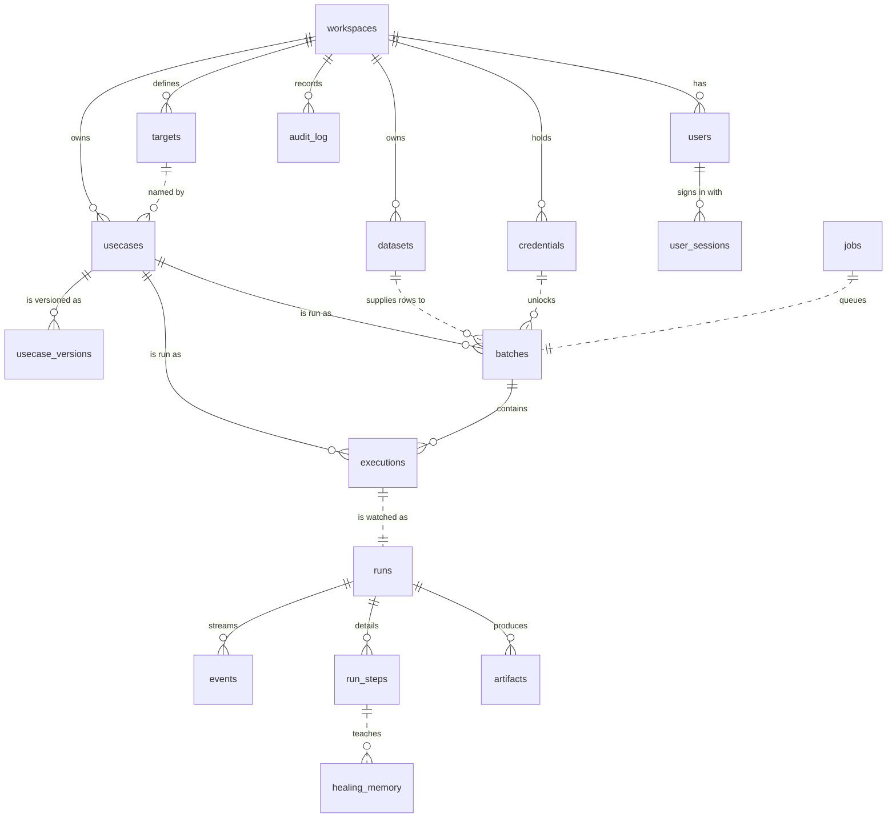

# The data model

Seventeen tables in one PostgreSQL schema, named by `DB_SCHEMA`. This is the
reference: what each table holds, why it holds it, and the handful of rules that
apply across all of them. The argument for the architecture is in
[deterministic-automation-platform.md](deterministic-automation-platform.md);
this document is the map.

Everything here is created by Alembic (`backend/migrations/`). The models are in
`backend/db/models.py` and are the authority — a table's docstring there says
more about its edge cases than this page does.

## The shape

Solid lines are foreign keys. Dotted lines are references held **without** a
foreign key, deliberately — see *History outlives its subject* below.

---

## Tenancy and identity

Four tables that answer "who is this, and what may they see".

### `workspaces`

One tenant. Four columns — `id`, `name`, `slug`, `created_at` — because a
workspace is a boundary, not a thing with properties. Every other tenant-owned
table carries `workspace_id` and cascades from here.

### `users`

A person who signs in. Holds `email`, `display_name`, a bcrypt `password_hash`,
a `role` (`viewer`, `operator`, `author`, `admin`) and `is_active`.

`credentials_changed_at` is the session kill switch: a token issued before this
timestamp is refused, so changing a password or role ends every session that
person already had, everywhere.

### `user_sessions`

One sign-in. Stores a **SHA-256 hash** of the bearer token, never the token —
the database cannot impersonate anyone with what it holds. `expires_at` and
`revoked_at` are checked on every request; `user_agent` is kept so a person can
recognise their own sessions.

### `audit_log`

Who did what, append-only. `action` (`usecase.publish`, `target.save`,
`memory.remember`, …), `resource_type`/`resource_id`, and a JSONB `detail` for
whatever else that action needs to record.

`actor_email` is stored **beside** `actor_id` on purpose: the FK is `ON DELETE
SET NULL`, so deleting a user must not erase the record of what they did.

---

## Authoring

What a workflow *is*, as opposed to what happened when it ran.

### `usecases`

The recipe, and the row every version hangs off. `status` is `draft`, `ready` or
`archived`; only `ready` can be executed, and moving a draft there re-validates
it.

| Column | |
|---|---|
| `current_version` | Points into `usecase_versions`. |
| `target` | Which [target](#targets) supplies the base URL. Empty means "the URL recorded into the definition". |
| `source_run_id` | The run this was distilled from, when it came from one. |
| `scripts_enabled` + `_by` + `_at` | Whether this use case may run raw JavaScript. It lives on the row rather than in the definition because it is a privileged grant by a named person, not a property of the recipe — and import never carries it across. |

### `usecase_versions`

The definition itself, as JSONB, keyed `(usecase_id, version)`. **Append-only:**
an edit writes a new version and never rewrites an old one, because a batch
already running is reading from a specific version and must not have it change
underneath it.

The JSONB document holds the steps, the locator ladders, the declared inputs and
secret *slots*, `allowed_domains`, and `base_url` — the origin the recording was
made against. It holds **no credential values and no environment addresses**,
which is what lets the same document be promoted from dev to production
unchanged.

### `targets`

A name, and the address it means **in this deployment**. `schemora` →
`https://uat.schemora.ai`. Unique per `(workspace_id, name)`.

This is the seam a use case is promoted through. The definition says *which*
site; each environment's own database says where that site is. Twenty use cases
against one site share one row, so moving that site's UAT host is one edit.

It is data rather than configuration deliberately: the base URL used to come
from an environment variable, which works only while every workflow in an
environment shares one site.

### `credentials`

A named set of secrets. `slots` (JSONB) lists the **names** the use case
declares; `ciphertext` is the encrypted values, Fernet-encrypted under
`CREDENTIALS_KEY`.

The plaintext is never stored and never returned by any endpoint. Lose
`CREDENTIALS_KEY` and these rows become unreadable, which is the intended
property.

---

## Input data

### `datasets`

An uploaded spreadsheet, parsed once and kept. `rows` is the parsed content and
`columns` is a profile of each column — kind, blank count, distinct count,
example values — which is what the column mapper reasons over.

Both are JSONB because they are read whole, by one owner, and never joined on.
Keeping the file as a resource is what makes the mapping step possible: upload,
look at what is in it, agree how its columns line up, and only then run
anything.

---

## Execution

Six tables, and the distinction between them is the thing most worth
understanding.

> **`batches` → `executions` → `runs`.** A **batch** is one press of "run this
> against these rows". An **execution** is one row of it. A **run** is the
> live view of an execution — its event stream, its steps and its screenshots.
> One batch of 500 rows produces 1 batch row, 500 executions and 500 runs.

### `jobs`

The durable work queue, and the reason this is a table rather than a broker:
enqueueing a job and writing the batch it refers to happen in **one
transaction**, so there is no window in which the UI shows a queued batch that
nothing will ever claim.

Claiming is `SELECT … FOR UPDATE SKIP LOCKED` with a lease
(`claimed_by`, `claimed_at`, `lease_expires_at`), so many workers never collide
and a worker that dies has its work reclaimed rather than lost. `dedupe_key`
makes a retried POST idempotent; `attempts`/`max_attempts`/`run_after` carry
retries and backoff.

### `batches`

One queued run over many rows. Counters (`total`, `succeeded`, `failed`) are
maintained as it goes.

`input_rows` (JSONB) is a **snapshot** of the rows taken when the batch was
queued — copied rather than referenced, so deleting the dataset afterwards does
not rewrite history, and a resume after a restart has somewhere to read them
from.

`base_url` is the address this batch actually resolved to, pinned at queue time.
A resume reads it back rather than resolving again, so a target edited halfway
through cannot move the remaining rows to a different deployment from the ones
already done.

### `executions`

One row of a batch, or one single run. Holds the `inputs` it ran with, the
`outputs` it extracted, `status`, `failed_step_id` and `error`, plus the cost
(`llm_calls`, `llm_tokens` — zero for an unhealed replay) and `duration_ms`.

`batch_id` is null for a one-off execution.

### `runs`

The live view: status, timing, step count. `events`, `run_steps` and `artifacts`
all hang off it.

> **Vestigial columns.** `task`, `start_url`, `summary` and `result` date from
> when a run was a natural-language instruction given to an agent. `task` is now
> written as a synthetic label (`"Replay: <name>"`, `"Batch: <name>"`) and the
> others are largely unused. They are still read by the run list, so removing
> them is a change with a UI half; treat them as display fields, not as meaning.

### `events`

The append-only stream of what happened, keyed `(run_id, seq)`. `type` and a
JSONB `payload`. This is what the live view tails and what a repair reads back
afterwards — a `step_failed` event carries the page as it was at the moment it
broke, which is what makes a fix proposable from history alone with no second
browser session.

### `run_steps`

One row per step performed — the audit trail, as a table rather than as events,
because it is queried (which steps drift, which are slow) rather than replayed.

`locator` is what actually matched and `locator_rung` is **how far down the
ladder** it had to go: a use case that starts falling through to weaker rungs is
drifting, and saying so early is the difference between a warning and a broken
batch. `screenshot_id`, `baseline_id` and `pixel_diff` back the visual
comparison.

### `artifacts`

Screenshots and Playwright traces. The row holds `kind`, `mime`, `bytes` and a
`path`; the bytes themselves live on disk locally or in S3 in a cluster, served
by presigned redirect.

---

## Learning

### `healing_memory`

A locator that broke, and what fixed it. Written when a repair is confirmed —
by the model at high confidence, or by a person — and read the next time
something breaks on the same site.

`domain` is a **hard `WHERE`, applied before ranking**, and `embedding` is a
pgvector column that only orders what survives that filter. Nearest-neighbour
over every fix ever recorded would cheerfully return a plausible button from an
unrelated site.

`confirmed_by` is `model` or a person's email, and it outranks distance when
past fixes are put in front of the model: somebody looked at that one and said
yes.

---

## Rules that apply everywhere

**Every tenant table carries `workspace_id`, and it is enforced by
construction.** Queries go through `WorkspaceStore`, which is built for one
workspace and cannot be asked for another's rows. Tenancy is not a `WHERE`
clause somebody has to remember.

**History outlives its subject.** Several references are held *without* a
foreign key — `run_steps.usecase_id`, `healing_memory.usecase_id`,
`executions.run_id`, `batches.dataset_id` — so deleting a use case or a dataset
does not cascade away the record of what it did. Where a FK does exist on
something deletable it is `ON DELETE SET NULL`, and a denormalized
`owner_email` sits beside `owner_id` for the same reason.

**JSONB where a document is read whole.** Definitions, dataset rows, event
payloads and audit details are read entirely, by one owner, and never joined on.
Anything queried across rows — status, counters, domain, timestamps — is a real
column with a real index.

**Append-only where a reader might be mid-flight.** `usecase_versions` and
`events` are never rewritten, because something is reading them while they
grow.

**What is never stored:** credential plaintext (only Fernet ciphertext), bearer
tokens (only their SHA-256), and any environment address inside a use case
definition.
