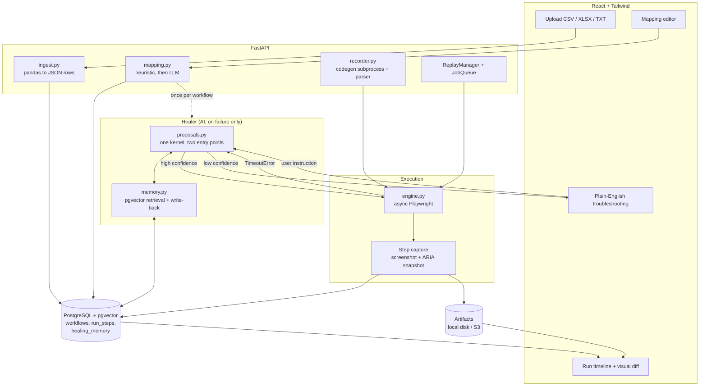

# From agent-recorded to codegen-recorded: a deterministic automation platform

**Status:** proposed — design only, nothing implemented yet
**Author:** drafted 2026-08-30
**Supersedes:** [`repeatable-usecases.md`](repeatable-usecases.md) — that document's
Phase 1 (LLM-agent recording + distillation) is replaced here. Its Phase 2 and
Phase 3 arguments survive almost unchanged, and are restated below where they
still apply.
**Companion:** [`../../TODO.md`](../../TODO.md) is the implementation checklist.

---

## 1. What is changing, and why

The existing system records a workflow by having an LLM *drive* a browser
through Playwright MCP, then distils that transcript into a replayable use
case. Replay after that point is free, and the measurements in
[`repeatable-usecases.md`](repeatable-usecases.md) show the payoff is real.

The cost is all at the front. One recorded workflow in this repository's own
data — run `0436a2a8`, 35 steps — consumed **~247,000 input tokens**, because
the agent re-sends its history on every turn and 87% of that history is
accessibility snapshots. It also failed 13 of 34 tool calls on its way to
succeeding, which is why distillation has to exist at all: most of what the
agent did is not part of the workflow.

That is a lot of machinery, and a lot of money, to learn something the user
already knows. **The user knows how to do the task — they do it by hand every
day.** They do not need a model to discover it; they need the software to watch
them do it once.

So the recording phase becomes `npx playwright codegen`, and the target
architecture is the one in the brief:

| Layer | Technology | Responsibility | AI cost |
|---|---|---|---|
| Frontend | React, Tailwind | Upload, mapping, run timeline, visual diff, plain-English troubleshooting | none |
| Backend | FastAPI, pandas | Ingestion, orchestration, step capture | none |
| Recorder | `npx playwright codegen` | Captures the manual session as a script | none |
| Engine | Python Playwright (async) | Deterministic parameterised replay | none |
| Healer | LangGraph + Bedrock, pgvector RAG | Column mapping at setup; locator recovery on failure | setup + failure only |

**Two AI moments, both bounded.** Mapping a dataset's columns to a form's
fields happens once per workflow, over a list of header names — hundreds of
tokens, not hundreds of thousands. Healing happens only when a locator breaks,
and only within a budget that already exists (`HealingBudget`).

Recording drops from ~247,000 tokens to **zero**.

### 1.1 What we give up, stated plainly

"Type a task in English and watch it work" goes away. `agent.py`, `graph.py`,
`chat.py` and `checkpoints.py` exist to serve that, and nothing in the target
architecture calls them. This is a deliberate product narrowing, not an
oversight: the users this is being built for are non-technical operators
repeating a known task over a spreadsheet, and for them the agent is a
liability — it is the expensive, non-deterministic, hard-to-explain part of a
product whose selling point is that it is cheap, deterministic and explainable.

If natural-language authoring is wanted back later, it returns as a *second
recorder* behind the same recording interface (§4.1), not as a second engine.

---

## 2. Target architecture



**The zero-token guarantee keeps its current form.** `engine.py` inherits
`replay.py`'s rule: it does not import `llm`, it has no constructor parameter
that could accept a model client, and the test asserting both is carried over
verbatim. The healer is *injected* as a protocol; with nothing injected there
is no code path to a model. This is the one invariant that must not be
weakened, because "zero tokens per row" is the product.

---

## 3. Data ingestion and mapping

**Status: done.**

### 3.1 Ingestion — pandas replaces the hand-rolled readers

Today `batch.py` has `parse_csv` (stdlib `csv`) and `parse_workbook`
(`openpyxl`), and the requirements file argues against pandas on the grounds
that it "needs cell values, not a dataframe, and pandas would pull in numpy for
nothing."

That argument was right for reading a batch file and wrong for what is being
built now. The new pipeline needs typed columns, null handling, mixed
encodings, `.txt` with an inferred delimiter, and a *profile* of each column
(dtype, null count, distinct count, three example values) to feed the mapper.
Writing that by hand is writing pandas badly. `ingest.py` replaces both
functions with one `read_table(data, filename) -> Dataset`.

Datasets become first-class rather than an anonymous upload attached to one
batch: uploaded once, profiled, stored, and reusable across runs. Mapping is
what forces that. It is a conversation -- upload, look at the file, agree the
columns, run -- and that is three round trips over the same rows; without a
resource the browser has to hold the file and post it each time, and the
suggestion is computed against something the server has never seen.

What was actually built: `ingest.py` with one `read_table`, replacing
`parse_csv` and `parse_workbook`; a `datasets` table; `POST /api/datasets` as
multipart; and `batch.py` reduced to the part that knows about *running* rows
rather than reading them.

**The fidelity rule is the one to preserve.** pandas reads and profiles, and is
never allowed to coerce. Files are read `dtype=str` and Excel cells converted
explicitly, because a reader that helpfully turns `0071` into `71` produces a
thousand wrong records and no error at all. The inferred type lives in the
profile, where it informs mapping, and never touches the value. `test_ingest.py`
asserts this directly -- leading zeros, spreadsheet floats and dates, and that
a blank cell never reaches a form as the word `nan`.

### 3.2 Mapping — heuristics first, model second

Mapping dataset columns to the workflow's declared fields is a *ranking*
problem over two short lists. Most of it is not a language problem at all:

1. exact match on normalised names (`Customer Email` to `customer_email`);
2. token overlap plus edit distance;
3. dtype compatibility (a date column cannot fill a numeric field);
4. value-shape agreement — a column of `...@...` matches a field recorded with
   an email in it.

Only what survives all four ambiguously goes to the model, as a single call
over header names and three sample values each. A workflow with well-named
columns therefore costs nothing to map, and the LLM is the fallback rather than
the mechanism. The user confirms every mapping in the UI regardless: an
automatic mapping that is wrong and unreviewed corrupts a thousand records.

**Sample values go to the model only after redaction.** `redaction.py` already
exists for exactly this and is reused rather than re-implemented.

As built, the model is not called at all yet. The heuristics resolve the files
this has been tried on, and `POST /api/usecases/{id}/mapping` returns an
`unresolved` list naming the fields where a model would earn its cost -- absent
matches, and matches whose top two candidates are within a hair of each other.
Reporting that rather than acting on it keeps the decision to spend tokens with
the caller, and makes the LLM step a small addition behind an existing seam
rather than a rewrite. `test_api_datasets.py` asserts the cheap path: a
well-named file comes back with `unresolved == []`.

**The mapping is applied at the boundary**, in `rows_for_batch`, before
validation and before the batch row exists. Everything downstream works in
declared field names and never learns what the spreadsheet called its columns.
Unmapped columns are dropped rather than passed through -- otherwise they reach
`validate_rows` as unknown inputs and send the user looking for a problem they
have already solved.

---

## 4. Recording

**Status: done.**

### 4.1 The codegen subprocess

`POST /api/recordings` spawns:

```
npx playwright codegen --target=python-async --output=<tmp> --save-storage=<tmp> <start_url>
```

in a **headed** browser, and returns a recording id the UI polls. The user does
the task once by hand and closes the window; codegen writes the script; the
backend parses it.

Three things this must get right, none of them optional:

**Lifetime.** The subprocess is a child of the API process and must not outlive
it. The existing `MCPBrowserSession` teardown discipline — a `finally` that
also runs on cancellation — is the pattern to copy, and it is the one piece of
`mcp_client.py` worth keeping in spirit after the module goes.

**Headed means local.** A codegen window needs a display, so recording is a
local-only operation and the EKS deployment (§8) runs *replay* workers only.
Recording on a server is a later problem with a different answer (a streamed
browser); it is explicitly out of scope, and the API returns 501 for it when
`RECORDER_ENABLED=false`.

**The script is untrusted input.** It is parsed with `ast`, never executed and
never `eval`'d. Anything the parser does not recognise is surfaced to the user
as an unsupported step rather than passed through.

### 4.2 Parsing codegen output into `UseCase`

Codegen emits a narrow, regular subset of the Playwright API, and it emits the
*good* locators — `get_by_role`, `get_by_label`, `get_by_placeholder`,
`get_by_test_id` — because that is what its own locator generator prefers. That
is a far better starting point than an agent transcript, and it is why the
distillation problem mostly evaporates:

| Distillation problem (§2 of the old design) | Under codegen |
|---|---|
| Ephemeral `ref=e17` targets | Gone. Codegen emits semantic locators. |
| 13 of 34 calls were failures | Gone. A human does not record their failures. |
| A third of steps are snapshots for the model | Gone. No model, no observations. |
| Values are baked in | **Still true** — this is what the parameteriser does. |
| Nothing verifies success | **Still true** — assertions still need proposing. |

So `distill.py` (1,274 lines: snapshot indexing, failure joining, retry-cluster
collapsing, ref resolution, and an LLM pass) collapses to a `codegen.py` that
does an AST walk plus the two rows that survive. `fields.py` — which already
turns literals into `{{input.x}}` / `{{secret.x}}` and knows how to keep
credentials out of the definition — is reused whole.

`Locator.strategy` gains `label`, `placeholder`, `test_id` and `alt_text`
alongside the existing `role` / `css` / `text` / `nth`. Each maps to exactly one
Playwright call, which is the point:

```python
{"role":        lambda p, l: p.get_by_role(l.role, name=l.name),
 "label":       lambda p, l: p.get_by_label(l.text),
 "placeholder": lambda p, l: p.get_by_placeholder(l.text),
 "test_id":     lambda p, l: p.get_by_test_id(l.text),
 "css":         lambda p, l: p.locator(l.selector),
 "text":        lambda p, l: p.get_by_text(l.text)}[loc.strategy](page, loc).nth(loc.nth)
```

**The ladder survives, and gets better.** `replay.py` today resolves a
`role`+`name` locator by taking a fresh MCP snapshot, parsing the YAML, and
finding the matching node. Playwright resolves `get_by_role(role, name=...)`
against the live page natively, with auto-waiting and strictness built in. The
durability argument is unchanged; the implementation gets shorter and the
failure modes get better names.

### 4.3 What P3 actually built

`Locator.strategy` gained the four rungs, and the ladder's partition changed
from "role or not" to **semantic or not**: `label`, `placeholder` and
`alt_text` all resolve against a snapshot taken *now*, exactly as `role` does,
because all three *are* the element's accessible name once a page has
rendered. `Snapshot.by_name` is the lookup that makes that possible, and it is
what keeps a codegen recording durable one phase before the engine swap rather
than one phase after. `test_id` becomes a `[data-testid="…"]` selector handed
to the server, which is why it is always recorded alongside something else.

A named `role` rung also records a free name-only rung beside it. It costs
nothing and it catches the redesign that keeps a control's label while changing
its element — a link that becomes a button.

**The parser refuses more than it accepts, deliberately.** A chained locator, a
`frame_locator`, a `.last`, a non-literal argument and a file upload are all
reported to the user as lines that were left out. None of them has an honest
representation in this schema, and the alternative to refusing is a step that
clicks something adjacent on row one of a thousand. `codegen.py` has a
golden-file test per supported action so a Playwright upgrade that changes the
emitted shape fails in CI rather than in production.

**The setup/row split is answered by the credentials.** A batch shares one
session, so signing in must happen once; a flat list of steps cannot say that,
and getting it wrong means a thousand sign-ins or a thousand unauthenticated
rows. The boundary is the last step that types a **declared secret**, plus the
click that submits it. That is not pattern-matching on the word "login" — a
credential is by definition the value a person supplies once, and the user has
just told us which values those are. With no secrets declared, nothing is
setup, and the draft says so in a warning rather than guessing.

Everything saved is a **draft**. The split is a heuristic, the parameterisation
is derived, and the assertions are whatever the user happened to record, so a
person publishes it — the same gate a distilled recording has always passed.

**Recording is local-only, by configuration rather than by luck.**
`RECORDER_ENABLED=false` makes the endpoints answer 501 with a sentence about
displays, instead of a spawn failing with an X11 error nobody can act on.

---

## 5. Execution engine

**Status: done.**

`engine.py` replaces `replay.py`, keeping its structure — `run_setup` once per
session, `run_row` per input row, `row_reset` between — because those exist to
stop a batch signing in a thousand times, and that requirement has not moved.
The `BatchRunner` recovery rules (a failed row never aborts the batch;
`session_check` between rows; re-login once; stop after N consecutive
failures) are untouched: they are about batch semantics, not about how a click
is issued.

What actually changes:

- **`MCPBrowserSession` becomes `async_playwright()`.** One browser, one context
  per batch, one page. No Node subprocess, no JSON-RPC hop, no tool-discovery
  handshake, and step latency drops from a round trip to a call.
- **Waiting is Playwright's job.** The hand-written settle logic goes; actions
  auto-wait for actionability, and `expect()` replaces the assertion evaluator
  for everything except URL and snapshot-shape assertions.
- **Tracing comes free.** `context.tracing.start(screenshots=True, snapshots=True)`
  produces a Playwright trace per execution, stored as an artifact. This is the
  single biggest debugging win of the swap and is not available through MCP.
- **The navigation allowlist stays.** `policy.check_navigation` and
  `domain_allowed` are called on every navigation and every `page.goto`, exactly
  as now. What goes is `policy.classify` and the `Category` machinery, which
  exist to decide whether an *agent's* action needs human approval — a question
  a deterministic replay of a human-recorded script does not ask.

### 5.0 What landed, and three things the design got wrong

`browser.py` owns the browser and `engine.py` executes a use case against it.
`replay.py` is no longer on either replay path, and `runner.py` constructs a
`PlaywrightSession` where it used to construct an `MCPBrowserSession`.

`tests/test_e2e_engine.py` is the file §11 made this phase conditional on:
eleven tests, a real Chromium, a two-page site served from a temp directory,
and nothing stubbed. It records a codegen script, parses it, replays it against
the live page, and checks parameterisation per row, the setup/row split,
locator drift, assertions, extraction, screenshots, traces and the allowlist.
Building it found three things this document had asserted and should not have:

**`snapshot.py`'s parser did not work on real `aria_snapshot()` output.** §6.1
claimed it was "kept and reused", which was true of the file and false of the
behaviour: the parser skipped every node without a `[ref=eN]` marker, and
Playwright's public API emits none. Fed a genuine aria snapshot it parsed
cleanly and returned *nothing* — the most expensive kind of wrong, because
every lookup then fails for a reason that looks like the page. Refs are
optional now, and `by_ref` keeps only the nodes that have one so `get("")`
cannot return an arbitrary element.

**A `label` fallback rung could never match a button.** P3 recorded a free
name-only rung beside every named `role` rung, as a `label`. Under MCP that
resolved by searching the snapshot for an accessible name, which matched
anything; under Playwright a rung is executed as the call it names, and
`get_by_label` matches only form controls that have a label. A button named
"Sign in" has text, not a label, so the fallback was dead. It is a `text` rung
now, and the e2e drift test is what caught it.

**`element_visible` assertions were evaluated against the snapshot**, which
could only resolve rungs whose value happens to be an accessible name. An
assertion on a `text` or `css` rung was therefore *unable to hold* — a check
that always fails is worse than no check, because it fails rows that worked.
Visibility is asked of the live page now, uniformly, with `count()` and
`is_visible()`, neither of which auto-waits; `_do_assert` still owns the
timeout.

**`tool_call` / `tool_result` events survive the swap.** There are no tools any
more, but those events are what the timeline, the WebSocket replay and the run
view are built on, and they are where a typed value passes through the redactor
on its way to the log. The engine emits one pair per action, named for the
action rather than for a tool. The dashboard needed no change.

The API tests moved with it: `tests/fake_browser.py` is a Playwright-shaped
double serving the same snapshot fixtures the MCP-shaped one did, so what those
tests assert is unchanged and only the surface underneath moved.

### 5.1 Step capture and the visual audit trail

**Status: done.**

Every step, in both recording and replay, writes a `run_steps` row:

```
run_steps(run_id, seq, phase, step_id, action, locator_describe,
          status, duration_ms, screenshot_key, snapshot_key,
          error, healed_from_version, created_at)
```

Screenshots and ARIA snapshots go to `storage.py` unchanged — it already
abstracts local disk and S3 behind an opaque key, which is exactly what the EKS
deployment needs.

**Why a table when `events` already holds this.** `events` is a log, and the
existing model docstring is emphatic that it is not the system of record. The
timeline UI wants "every step of this execution with its status, duration and
screenshot" as one indexed query, and the diff UI wants to join a replay step to
the *recorded baseline* step by `step_id`. Both are projections, not scans, and
building them out of a JSON event log is how a project ends up event-sourcing
by accident.

**The visual diff** is that join, rendered side by side per step, with a
pixel-difference ratio computed on write so the UI can jump to the first
divergence instead of making a person scroll. Pixel diffing uses Pillow, which
is a new dependency and a small one; SSIM and friends are not worth numpy here.

**The baseline is not what this document said it was.** §5.1 planned to compare
against "the baseline recorded screenshot" — but a recording made by
`playwright codegen` has no screenshots. Codegen owns that browser and we never
see its pages, so there is nothing from the day it was recorded to diff
against. The baseline is instead **the last run of the same version that
worked**, per step id. That is arguably the more useful question anyway: not
"does this match the recording" but "what changed since it last worked".

Two consequences worth stating. `null` and `0.0` are different answers — no
baseline versus nothing moved — and conflating them would report a first run as
a perfect match with something that does not exist. And the ratio is not a
verdict: a rendered clock moves a few pixels and means nothing, a form that
silently failed to submit can move very few and mean everything. The UI shows
it in words, opens on the first divergence, and lets a person decide.

---

## 6. Healing, and the memory that makes it cheaper over time

**Status: the memory is done. The kernel merge (C2) is not — see below.**

### 6.1 One kernel, two entry points

`healing.py` (274 lines, mid-run, locator-only) and `repair.py` (450 lines,
post-mortem, fixes locators/assertions/values/dropped steps) implement the same
idea at two moments, with two prompts, two choose-an-element-by-index schemas
and two budgets — and the safety invariant *the model cannot invent a locator*
is implemented twice and must stay true twice. This was already on the backlog
as **C2**; the redesign is the moment to do it.

`proposals.py` holds one kernel: gather candidates from the page, retrieve
prior fixes, ask the model to choose, validate the choice against the
candidates, return a `Proposal` with a confidence. `heal_step()` and
`repair_usecase()` become thin strategies over it.

**The safety property is preserved exactly.** The model receives a numbered
list of controls that are actually present and returns an index. A hallucinated
selector has no route into a use case — under MCP that list came from parsing a
snapshot; under Playwright it comes from `locator.aria_snapshot()`, which emits
the same YAML tree. `snapshot.py`'s parser is therefore kept and reused; only
`is_ref` / `extract_ref` / `by_ref` die with the ref concept.

### 6.2 RAG over past fixes

```
[replay failure]
   -> capture ARIA snapshot + error + failing step
   -> embed (Bedrock Titan) and query healing_memory
        WHERE workspace_id = ? AND domain = ?
        ORDER BY embedding <=> :q LIMIT 5
   -> prompt: failing step + candidates + those 5 prior fixes
   -> confidence >= threshold  -> apply, resume, record
      confidence <  threshold  -> plain-English alert + user instruction
   -> either way, write the confirmed fix back to healing_memory
```

```
healing_memory(id, workspace_id, usecase_id, domain, step_id,
               error_kind, dom_context, old_locator, new_locator,
               explanation, confirmed_by, embedding vector(1024), created_at)
```

Three constraints on this, each learned from the parts of the system that
already work:

**Scoped like everything else.** Retrieval goes through `WorkspaceStore`, not
`Store`. A tenant must not be shown another tenant's selectors — they leak the
shape of another company's internal tooling. The existing pattern makes the
unscoped query unwritable rather than merely discouraged, and that is why it is
the pattern.

**Domain-filtered before it is vector-searched.** Nearest-neighbour over every
fix ever recorded will cheerfully return a plausible button from an unrelated
site. `domain` is a hard `WHERE`, and the vector distance only orders what is
left.

**Retrieval is an optimisation, never an authority.** A retrieved fix is
context in the prompt. The model still chooses from candidates present on the
page *now*, and the choice is still validated against them. A poisoned or stale
memory can make healing worse; it must not be able to make it unsafe.

### 6.2.1 What was built, and the one thing that was not

`embeddings.py`, `memory.py`, the `healing_memory` table on pgvector, and the
three endpoints under `/api/memory`. Healing recalls past fixes on the same
domain before it asks, records a fix it made with high confidence, and a person
can add one from the step trail when the model was not sure enough.

Three properties are enforced in three different places, deliberately:

* **Scoped** by `WorkspaceStore`, so a tenant cannot be shown another tenant's
  selectors — they describe the shape of another company's internal tooling.
* **Domain-filtered** in the query, before the vector orders anything. A
  nearest-neighbour search over every fix ever recorded will cheerfully return
  a plausible button from an unrelated site.
* **Never authoritative**, in `healing.py`: what comes back is context in a
  prompt, and the model still picks from candidates on the page *now*. A stale
  or poisoned memory can make healing worse; it cannot make it unsafe.

Only a fix somebody stands behind is written — high confidence from the model,
or a person's own words. Recording every attempt would fill the table with the
guesses that failed, which are precisely the answers not to give next time. A
human-confirmed fix outranks a closer automatic one when they are ranked for
the prompt, and anything in there can be forgotten, because a fix that was
right last month and wrong now is exactly what makes healing confidently
incorrect.

Embedding failures are not errors. The embedder is a network call to somebody
else's service; when it fails, healing behaves exactly as it did before there
was a memory. A test asserts that, because the failure mode of an optimisation
must be "no optimisation", never "no run".

**C2, the kernel merge, was not done.** `healing.py` and `repair.py` still
implement choose-an-element-by-index twice, with two prompts and two budgets,
and the safety invariant is still kept true in two places. The memory was the
half with a user-visible payoff and the merge is a refactor with none, so given
a choice of where to spend the risk, it went on the capability. It remains
worth doing and is still item **C2**.

**The repair button had no memory at all, in either direction.** The design says
one kernel, two entry points, and only one of them was wired to the memory. The
in-run healer recalled past fixes and wrote every high-confidence repair down;
`repair.py` did neither. So the path a person actually presses re-derived the
same page change on every press, at the cost of a call each, and left nothing
behind however many times it worked -- eight repairs against one deployment
produced zero rows in `healing_memory`.

Both directions are wired now. A repair writes each locator change it landed,
stamped with the person's email rather than `model`: they chose the repair,
looked at the result and published it, which outranks an unattended heal and is
what `as_prompt` sorts on. And the doctor's prompt carries `$past_fixes`, so the
second press is told what the first worked out.

What it learns is read off the *result* rather than the proposal, by comparing
the definition before and after. A fix that was proposed is not a fix that
landed -- the model can name a step that does not exist or an element index off
the end of the page, and those are skipped -- so reading the outcome is what
keeps the memory free of lessons that were never applied.

Remembering never fails a repair. The mend is the point and the memory is the
bonus, so an embedder that is down or switched off costs the lesson and not the
fix.

**Worth stating for operators:** `replay_healing_enabled` is `false` by default,
so on a stock deployment nothing heals mid-run and every failure needs the
button. That default is deliberate -- healing is also the easiest way to turn a
free batch back into an expensive one -- but it does mean the memory is only
read by the repair path until somebody turns healing on.

### 6.3 Plain English, and the human in the loop

Below the confidence threshold, the run stops on that row and the UI shows the
model's explanation — "the *Submit Order* button is now labelled *Confirm
Purchase* and sits inside a dialog" — with the before/after screenshots and a
text box. The user's instruction ("click the blue button at the bottom") goes
back through the same kernel as an additional constraint on candidate choice.

The result is a **draft version**, published by a person, exactly as a distilled
use case is today. Nothing auto-publishes; `repair.py`'s rule survives intact.

---

## 7. Wiring the queue that already exists

**Status: done.**

`jobs.py` is 462 lines of a correct Postgres work queue — `SELECT ... FOR
UPDATE SKIP LOCKED`, leases rather than lock flags, per-workspace concurrency —
that **nothing calls**. `enqueue`, `list_jobs` and `purge_finished` have zero
callers and no tests; startup calls `reclaim_expired()` against a table nothing
writes. `ReplayManager` still runs batches in-process.

Finishing it is strictly less work than replacing it with Celery + SQS, and it
keeps a property a broker cannot give without an outbox table: **the batch row
and its job are written in one transaction**, so there is never a queued batch
no worker will run. KEDA scales on queue depth either way — its PostgreSQL
scaler takes a query, which for us is one `COUNT(*)` over `jobs`.

- `ReplayManager.start_batch` enqueues instead of spawning a task.
- `ReplayManager.run_batch_job` is the worker-side handler; `backend/worker.py`
  is the standalone process, `make worker` runs it, and `WORKER_ENABLED` decides
  whether the API process also claims work (true by default, so a
  single-machine install needs nothing else started).
- The `ExecutionBusy` single-slot lock is gone. Per-workspace concurrency in
  `jobs.py` replaces it: the same one-at-a-time guarantee for one tenant, and a
  better one for several. A second batch is now queued rather than refused with
  a 409.

Two consequences fell out of making the work claimable by another process, and
both are improvements rather than costs:

**A batch stores its rows.** They used to live only in the memory of whichever
process accepted the upload. Resume worked around that by rebuilding rows from
`executions.inputs`, which substitutes an empty row for anything never
attempted — exactly the set a resume exists to run. A resume after the circuit
breaker tripped therefore replayed blanks. `batches.input_rows` fixes that, and
`pending_row_indices` now takes the row count so "what is left to do" is
computed against the batch rather than against the attempts it managed to make.

**A batch cannot take inline secrets.** Only the credential id crosses to the
worker, which opens the vault itself. Carrying values instead would mean
writing a password into a table that a batch listing reads — the thing the
vault exists to prevent, and the same argument `stash.py` makes at the other
end of the recording flow. The dashboard only ever sent `credential_id`, so
nothing in the UI changes.

`jobs.py` had no tests, which is a large part of how it stayed unwired.
`tests/test_jobs.py` now covers exclusivity of a claim, lease reclamation,
per-workspace concurrency, tenant-scoped cancellation, dedupe, and the
transactional enqueue that is the whole argument for a table over a broker.

---

## 8. Running it: local, server, and the road between them

### 8.1 On your machine

**Status: done.** This is the only mode where recording works, and it is the
mode the product is authored in.

Two processes against a PostgreSQL you already have. No Docker anywhere in this
path — there is a compose file, but it exists for people who would rather not
install Postgres, not as the intended route.

```bash
python -m venv .venv
.venv/Scripts/python -m pip install -r backend/requirements.txt
.venv/Scripts/python -m playwright install chromium
cd backend && ../.venv/Scripts/python -m alembic upgrade head
cd backend && ../.venv/Scripts/python serve.py     # terminal 1
cd frontend && npm install && npm run dev          # terminal 2
```

`README.md` carries the long form. Three things about it are load-bearing and
easy to get wrong, so they are repeated here.

**Start the API through `serve.py`, not through uvicorn directly.** Two Windows
constraints collide, and neither can be resolved on uvicorn's command line.
Playwright launches its driver as a subprocess through asyncio, and on Windows
only a `ProactorEventLoop` can do that — but uvicorn switches to a
`SelectorEventLoop` whenever `--reload` is set, so `uvicorn main:app --reload`
is the one command under which nothing can be recorded or replayed. Passing
`--loop none` fixes that and breaks something worse: uvicorn's reloader binds
the listening socket in the parent and hands it to the child, and on Windows an
inherited socket cannot be registered with the child's IOCP. Every accept then
fails with `[WinError 87]` — *after* "Application startup complete", so the
server looks healthy and answers nothing. `serve.py` resolves both by reloading
a level up: `watchfiles` restarts the whole process, and each new process binds
its own socket in the loop that will use it.

**Playwright needs the Chromium it installed itself**, at the revision matching
the pinned package. A Chromium already on the machine is not that.

**`DB_SCHEMA` is a name, not a namespace to share.** The application creates the
schema and migrates it; point it at one another project has stamped and Alembic
refuses. The test suite uses `browser_test` and truncates every table in it
before each test, so never aim `TEST_DB_SCHEMA` at anything real — and never run
two pytest processes at once against the same test schema.

### 8.2 On a server

**Status: manifests, not a running cluster.** `deploy/k8s/` has been validated as
YAML and its shapes are conventional, but nothing here has run on a cluster. The
addresses, ARNs and the KEDA connection string are placeholders;
`deploy/README.md` says what to substitute.

The image is `mcr.microsoft.com/playwright/python`, with no Node and no MCP
package. Its tag has to match the `playwright` pin in `requirements.txt` — the
Python package looks for a specific browser revision, and a mismatch fails at
launch with a message about a missing executable that says nothing about
versions.

Two details in `worker.yaml` are there because their absence is miserable to
debug: a 1Gi memory floor, below which Chromium starts failing to render pages
in ways that look like flaky selectors; and a `/dev/shm` mount, without which
tabs crash under load and the crash surfaces as a browser that closed mid-step
rather than as anything mentioning memory.

One trap worth stating plainly: `keda.yaml` hardcodes the schema in its query
(`FROM browser.jobs`). Deploy with a different `DB_SCHEMA` and that query does
not error — it reports zero queued jobs for ever, and the workers never scale
up. Change both or neither.

### 8.3 The shape of a deployment

```
                        ┌──────────────┐
   person, recording ──▶│ their laptop │  headed Chromium + Inspector
                        └──────┬───────┘  (not in the cluster; see below)
                               │ saves a draft over HTTPS
                               ▼
        ┌─────────────────────────────────────────┐
        │  API Deployment (2+ replicas, ALB)      │
        │  WORKER_ENABLED=false                   │
        │  RECORDER_ENABLED=false                 │
        └───────────────┬─────────────────────────┘
                        │ enqueues a row in `jobs`
                        ▼
        ┌─────────────────────────────────────────┐
        │  Aurora PostgreSQL + pgvector           │
        │  use cases, runs, jobs, healing memory  │
        └───────────────┬─────────────────────────┘
                        │ KEDA reads queue depth
                        ▼
        ┌─────────────────────────────────────────┐
        │  Worker Deployment (0 → 20, KEDA)       │
        │  headless Chromium, one browser per job │
        └───────────────┬─────────────────────────┘
                        │ screenshots, traces
                        ▼
                     S3, served by presigned redirect
```

**Why execution scales and recording does not.** Claiming a job is
`SELECT … FOR UPDATE SKIP LOCKED` with a lease, so twenty worker pods never
collide, and a pod that dies has its work reclaimed rather than lost. Nothing
about a replay is tied to the pod running it. That is what makes "many people
running batches at once" a matter of raising `maxReplicaCount`.

Per-workspace concurrency is enforced by a query against the `jobs` table rather
than an in-process counter, so it holds across pods. It is a soft limit:
saturation is computed just before the claim rather than atomically with it, so
under a race N pods can each claim one job for the same workspace and overshoot
by roughly the pod count.

**Recording is the opposite shape**, and `RECORDER_ENABLED=false` in the
configmap is a decision rather than an omission. `playwright codegen` opens a
*headed* browser and the Playwright Inspector, and the entire point is that a
person drives it — headless is not a variant of this but the absence of it. The
sessions also live in a dictionary in the API process and are cleared at
shutdown, so with two replicas a status poll lands on a pod that has never heard
of the recording about half the time.

Running it in the cluster is possible, and it is a feature rather than a
configuration: Xvfb for a display, a VNC server with noVNC to put the window in
the person's browser tab, one pod per active recording addressed directly rather
than a load-balanced Deployment, and a lifecycle that tears the pod down when the
window closes or the timeout expires. Playwright's remote-connect options do not
shortcut this — the Inspector UI is process-local, so there is nothing to attach
to.

The recommendation is to leave it split: workers in the cluster, recording on the
laptop. Recording is an occasional authoring act by one person and does not need
to scale, and putting a browser behind VNC makes the one interactive part of the
product slower and more fragile for no throughput gained. Overrule that for
locked-down laptops, sites reachable only from inside the VPC, or a requirement
that automation egress from a fixed address.

### 8.4 Promoting a use case through dev, UAT and production

**Status: not built.** This section describes the intended model and names what
is missing, because the gap is not visible from the outside: the data model
supports promotion and the API does not.

**The intended model.** A use case is a JSON document with a version history.
Recording happens once, against dev. What moves between environments is that
document — not a re-recording. Each environment is a separate deployment with its
own database, its own `CREDENTIALS_KEY` and its own credentials, and nothing
sensitive travels with the document, because secrets are *slots* in it rather
than values.

```
  record (dev) ──▶ review, name fields ──▶ publish ──▶ ready in dev
                                                            │
                                      export the definition │
                                                            ▼
                        import into UAT  ──▶ publish ──▶ ready in UAT
                                                            │
                                                            ▼
                        import into prod ──▶ publish ──▶ ready in prod
```

`publish` is per-environment and already exists: it re-validates the document at
`ready`, which is where the stricter rules bite — most notably that a use case
carrying raw JavaScript cannot be published until someone has read the code and
turned `allow_scripts` on. Publishing in dev says nothing about UAT, which is the
point. Each environment gets its own approval and its own audit entry.

**Import.** **Built.** `POST /api/usecases/import` takes a definition and lands
it here. It used to be impossible: `PUT /usecases/{id}` calls `usecase_or_404`
first, so it can only update something that already exists, and the only path
that created a use case was saving a recording.

Two things are deliberately not carried across, both because an approval given
in one environment is not an approval in another:

* `status` always arrives at `draft`. Publishing is per-environment and it
  re-validates, so UAT looks at this rather than inheriting dev's decision.
* `allow_scripts` always arrives false. It is the flag that lets a use case run
  arbitrary JavaScript against a live page, granted by a person who has read
  that code. Carrying it would let code approved against dev's data execute
  against production's.

The id *is* preserved, so one use case is the same use case everywhere and a run
in UAT can be lined up against the run in dev it came from. Re-importing appends
a version rather than duplicating, which makes promoting a revision the same
gesture as promoting it the first time. A `source_run_id` is dropped: it names a
run in another database.

Promotion is therefore two calls:

```bash
curl -H "$DEV_AUTH"  https://dev/api/usecases/$ID | jq .definition > uc.json
curl -H "$UAT_AUTH" -X POST https://uat/api/usecases/import -d @uc.json
```

**What is missing, second: environments differ in ways the document hardcodes.**
Three of them, and only two need work.

*URLs.* **Built, then rebuilt.** The first attempt answered `{{env.base_url}}`
from `USECASE_ENV`, one map per deployment. That holds only while every use case
in an environment shares a base URL. Run workflows against several sites -- the
normal case -- and it becomes a variable per site, set in the environment,
needing a release to add one. Configuration standing in for data.

What replaced it: **a use case names a target, and the deployment says where that
target is.** A target is a row -- `schemora` -> `https://uat.schemora.ai` --
edited by the people who run the workflows, in the environment they are running
them in. Twenty use cases against one site share one row; moving that site's UAT
host is one edit; onboarding a new site is a row rather than a release.

Three sources, most specific first, in `resolve_base_url`:

1. **An override given when the run was started**, for a one-off against a
   branch deployment or one customer's tenant.
2. **The target the use case names**, looked up in this deployment's targets.
   The ordinary path.
3. **The URL recorded into the definition**, which is what lets a
   single-environment install run with nothing configured at all.

A named target this deployment cannot answer is an **error, never a fallback**.
Quietly dropping to the recorded URL would send a use case promoted to
production at whatever host it was recorded against -- silently, on a run
somebody had every reason to trust. The refusal names the missing target and
lists what this deployment does have.

A batch resolves once, when it is queued, and stores the address on the batch
row. A resume reads it back rather than resolving again, so a target edited
halfway through cannot move the remaining rows to a different deployment from
the ones already done. `USECASE_ENV` remains for any other `{{env.*}}` value a
deployment wants to answer; it no longer carries the base URL.

*The allowlist.* **Built.** `allowed_domains` is still derived from the pages the
recording visited, but the recording's own origin is stored there as
`{{env.base_url}}` rather than as a literal host, and resolves through the
target above. It resolves to exactly one host
per deployment, so promotion never has to remember to widen it and cannot widen
it to two environments at once -- a use case allowed to reach both UAT and
production is one bad input away from acting on the wrong one. The engine renders
the allowlist before matching, and reduces a rendered origin to its host, since
`env.base_url` has to carry a scheme in order to build URLs.

*Credentials.* Already per-environment and already right: secrets are slots,
values live encrypted per workspace under that deployment's `CREDENTIALS_KEY`,
and none of it is in the document. Each environment supplies its own before the
first run. This is the part that needs no change.

**What is left.** Nothing, for the mechanism. A use case recorded today carries
no environment inside it, imports into UAT and production as a draft, and is
approved there on its own merits. What has *not* happened is a promotion run end
to end against three real deployments, which is the only thing that will find
whatever this section still has wrong.

The remaining convenience is a UI: promotion is two API calls today, and
`api.ts` has `importUseCase` ready for whatever drives it.

**Datasets do not promote.** A dataset is rows of business data, not
configuration, and each environment's data is its own. Only the use case moves.

---

## 9. What gets deleted

### 9.1 Dead today, independent of this redesign

**Status: done.** Found by an AST reference scan, then checked by hand —
which mattered, because the scan produced three false positives worth
recording. It counts a bare name, so anything reached by a decorator or by a
path it did not walk looks unreferenced:

| Looked dead | Actually |
|---|---|
| `config.py` `Settings._blank_to_none` | A live `@field_validator`. Pydantic calls it; no source line does. |
| `store.py` `Store.list_workspaces` | Called by `scripts/manage.py`, which the scan excluded from "production". |
| `store.py` `Store.ensure_workspace` | The fixture every database test builds its workspace with. |

A scan proposes; it does not decide. What was actually removed:

| Location | Disposition |
|---|---|
| `credentials.py` `CredentialRecord` | deleted — superseded dataclass |
| `credentials.py` `missing_slots` | deleted with its test; `services.py` does this now |
| `redaction.py` `secrets_from_mapping` | deleted with its tests |
| `bus.py` `subscriber_count`, `watched_runs` | deleted — introspection nothing introspects |
| `replay.py` `SessionLost` | deleted — raised nowhere |
| `batch.py` `json_dumps` | deleted |
| `db/base.py` `timestamp_column` | deleted |
| `fields.py` `DeclaredField.matchable` | deleted |
| `store.py` `WorkspaceStore.get_execution` | deleted |
| `mcp_client.py` `summarise_tools` | deleted (the module goes in P4 anyway) |
| `usecase.py` `brittle_steps`, `Locator.brittle` | deleted with their tests — nothing rendered the flag. P3's review UI is where it belongs, at the point where something shows it |
| `auth/service.py` `purge_expired_sessions` | **wired, not deleted** — the sessions table grew without bound because nothing swept it. Startup now does, beside `reap_orphaned_runs` |
| `jobs.py` `enqueue` / `list_jobs` / `purge_finished` | **wired, not deleted** — see §7 |

The frontend has no unused exports.

### 9.2 Superseded by this redesign

| Module | Lines | Fate |
|---|---:|---|
| `agent.py` | 858 | delete |
| `mcp_client.py` | 467 | delete |
| `chat.py` | 192 | delete |
| `checkpoints.py` | 117 | delete |
| `graph.py` | 112 | delete |
| `distill.py` | 1,274 | becomes `codegen.py` (~400) |
| `replay.py` | 1,056 | becomes `engine.py` (~700) |
| `healing.py` + `repair.py` | 724 | becomes `proposals.py` (~500) |
| `runner.py` | 1,099 | `RunManager` / `RunApprovalGate` out (~400) |
| `policy.py` | 345 | `classify` / `Category` / `Decision` out (~225) |
| `snapshot.py` | 279 | `is_ref` / `extract_ref` / `by_ref` out (~30) |
| `prompts/` | — | `system`, `task`, `loop_nudge`, `navigation_blocked`, `empty_tool_result`, `approval_rejected`, `distill` deleted; `heal*` + `repair*` merged |
| Tests | 1,855 | `test_agent_loop` (472), `test_graph` (177), `test_distill` (948) deleted; `test_policy`, `test_snapshot` shrink |
| Frontend | ~290 | `TaskComposer`, `ApprovalBar` deleted; `RunView` loses the approval path |
| Settings | — | `AGENT_*`, `MCP_*`, `CHECKPOINT_*`, `LLM_DISTILL_MODEL` removed from `config.py` **and** `.env.example` |

Roughly **3,300 production lines removed** and ~1,600 added, before the new
frontend. The point is not the number; it is that two ways of driving a browser
become one.

### 9.3 Explicitly kept

`store.py`, `db/`, `auth/`, `bus.py`, `jobs.py`, `storage.py`, `credentials.py`,
`redaction.py`, `fields.py`, `stash.py`, `lifecycle.py`, `services.py`,
`deps.py`, `events.py`, `usecase.py`, `batch.py`, `llm.py`, `config.py`,
`logging_setup.py`, and every router except the agent-run endpoints. The
platform layer -- tenancy, identity, audit, migrations, artifact storage,
event fan-out -- is not what is being redesigned, and nothing below it moves.

---

## 10. Order of work

Two orderings are load-bearing and easy to get wrong:

- the `Locator` strategies (**P2**) must land before the parser (**P3**), or
  the parser has nowhere to put a `get_by_label`;
- `run_steps` (**P4**) must land before the visual diff and before healing
  writes `healed_from_version`, or two migrations fight over the same table.

| Phase | Work | Ships |
|---|---|---|
| **P1** ✅ | Delete §9.1. Wire `jobs.py` (§7), delete `ExecutionBusy`. | A queue that works, and less code |
| **P2** ✅ | `ingest.py` (pandas), datasets as a resource, `mapping.py`, mapping UI. | Upload, then confirm mapping |
| **P3** ✅ | `Locator` strategies, `codegen.py` parser, `POST /api/recordings`. | Record by hand |
| **P4** ✅ | `engine.py` on async Playwright; tracing; the real-browser test; the deletions. (`run_steps` moved to P5, which is the only thing that needs it.) | One engine |
| **P5** ✅ | `run_steps`, pixel diff, the step trail. | The audit trail |
| **P6** ◐ | pgvector, `healing_memory`, plain-English, the human loop. `proposals.py` (C2) not merged. | Healing that learns |
| **P7** ✅ | EKS manifests, KEDA, S3, Aurora. | Scale |
| **P8** ✅ | Base URL binding, allowlist rewrite, import endpoint (§8.4). Untried against three real deployments. | dev → UAT → prod |

P1 and P2 are independent of the engine swap and can land immediately. P4 is
the irreversible one. P8 is complete as a mechanism and unproven as a
procedure: the pieces are tested, and no use case has yet been promoted across
three real deployments.

**What P4 removed.** `agent.py`, `mcp_client.py`, `graph.py`,
`checkpoints.py`, `distill.py`, `replay.py` and `stash.py`, together with
`RunManager`, the approval rendezvous, the agent's HTTP endpoints, its seven
prompts, twenty-three settings, and four frontend components. The backend is 31
modules and ~11,000 lines, and an AST reference scan over it now reports
nothing dead at all.

`chat.py` survived, against the plan. §9.2 listed it for deletion on the
grounds that it existed only to translate between message dialects for the
agent — but healing and repair still speak that dialect, and `llm.py` builds
its Bedrock client through it. Deleting it broke the model layer, so it was
restored. Finishing that migration is backlog item **C4**, and it is now the
only thing standing between this codebase and one message format.

`run_steps` moved to P5. It exists to back the visual diff, nothing else reads
it, and adding an unused table during a removal would have been the opposite of
the point.

---

## 11. Risks

**Codegen output is not a stable API.** Playwright can change what it emits
between releases. Mitigation: the parser handles a documented subset, pins the
Playwright version in `requirements.txt` and `.tools/package.json`, and reports
an unsupported line to the user instead of guessing. A golden-file test per
supported action makes a Playwright upgrade fail loudly in CI.

**No end-to-end proof yet.** Every test fakes the browser session (backlog
**E3**). Swapping the browser layer while every test fakes it is the largest
risk in this document. P4 must land with the record-then-replay test against a
local static site that E3 has been asking for, and `RUN_E2E=1` already exists to
hang it on.

**pgvector needs an extension.** Aurora supports it; a stock local Postgres
needs `CREATE EXTENSION vector` and the migration must fail with that sentence
rather than a driver error.

**Windows.** `checkpoints.py` exists because psycopg's async mode needs a
Selector loop while the browser subprocess needs Proactor. Deleting the
LangGraph checkpointer removes psycopg's async use, which removes the conflict —
but async Playwright on Windows has its own Proactor requirement, so P4 must be
smoke-tested on Windows before `replay.py` is deleted, not after.
